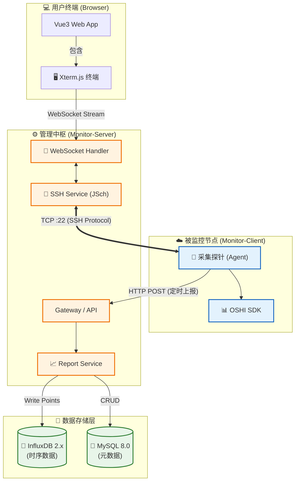

# 🚀 Monitor System | 分布式服务器运维监控平台

<p align="center">
  
  
  
  
  
</p>

> **Monitor System** 是一个基于 **Spring Boot 3** 和 **Vue 3** 的全栈分布式运维平台。它集成了 **OSHI** 硬件采集、**InfluxDB** 时序存储以及基于 **WebSocket + JSch** 的 Web SSH 终端，旨在为开发者提供一个开箱即用的轻量级运维解决方案。

---

## 🖼️ 界面预览 (Preview)

| 📊 实时监控仪表盘 | 💻 Web SSH 远程终端 |
| :---: | :---: |
| *(在此处放置 Dashboard 截图)*<br>CPU/内存实时折线图 | *(在此处放置 WebSSH 截图)*<br>基于 Xterm.js 的全功能终端 |

---

## ✨ 核心特性 (Features)

### 1. 🖥️ 深度硬件监控
*   **多维度采集**：基于 **OSHI (v6.x)** 深入底层，精准采集 CPU (System/User/Wait)、内存 (Used/Free/Swap)、JVM 堆内存等核心指标。
*   **分布式探针**：轻量级 Client 端设计，支持多台服务器同时上报，毫秒级数据刷新。

### 2. 💾 高性能时序存储
*   **InfluxDB 2.x 驱动**：摒弃传统关系型数据库存储监控数据的方案，采用时序数据库处理高并发写入。
*   **数据降采样**：利用 Flux 查询语言实现数据的自动聚合（Aggregate Window），轻松应对海量历史数据查询。

### 3. 🔌 Web SSH 终端 (亮点)
*   **浏览器即终端**：集成 **Xterm.js** + **xterm-addon-fit**，提供接近原生 Shell 的操作体验。
*   **全双工通信**：后端使用 **JSch** 建立 SSH 连接，通过 **WebSocket** 实现标准输入输出流（StdIn/StdOut）的实时透传。
*   **自适应布局**：支持窗口大小自动调整 (Resize)，完美适配 `vi/vim`、`top`、`htop` 等全屏应用。

---

## 🛠 技术架构 (Architecture)

### 技术选型

| 领域 | 技术栈 | 版本及说明 |
| :--- | :--- | :--- |
| **后端框架** | Spring Boot | `3.3.5` (严格锁定版本，确保稳定性) |
| **前端框架** | Vue 3 + Vite | 配合 Element Plus 与 ECharts 5 |
| **硬件采集** | OSHI | `6.4.x` 跨平台硬件信息库 |
| **SSH 核心** | JSch | `0.1.55` Java SSH2 实现 |
| **实时通讯** | WebSocket | Spring Boot Starter WebSocket |
| **数据存储** | InfluxDB | `v2.7` 时序数据存储 |
| **构建工具** | Maven | 多模块 (Multi-module) 构建 |

### 架构图



---

## 📂 项目结构 (Structure)

采用 Maven 多模块架构，职责分离，依赖清晰：

```text
GraduationProject-ServerMonitor (Root)
├── 📂 .idea                        # IntelliJ IDEA 项目配置目录
├── 📂 monitor-project              # [后端] Maven 父工程 (聚合管理依赖版本)
│   ├── 📂 monitor-common           # [公共模块] 被 Client 和 Server 共同依赖
│   │   ├── 📂 src/main/java/com/monitor/common
│   │   │   ├── 📂 domain           # 实体类 (CPU, Mem, Jvm 等 DTO/VO)
│   │   │   ├── 📂 utils            # 工具箱 (IpUtil, OshiUtil, DateUtil)
│   │   │   └── 📂 service          # 公共接口定义 (IReportService)
│   │   └── 📄 pom.xml
│   │
│   ├── 📂 monitor-client           # [探针端] 运行在被监控的目标服务器
│   │   ├── 📂 src/main/java/com/monitor/client
│   │   │   ├── 📂 config           # 配置类 (RestTemplateConfig)
│   │   │   ├── 📂 task             # 定时任务 (CollectTask: 5秒采集一次)
│   │   │   ├── 📂 core             # 核心采集逻辑 (HardwareGatherer)
│   │   │   └── 📄 MonitorClientApplication.java
│   │   ├── 📂 src/main/resources
│   │   │   └── 📄 application.yml  # 配置: server-url, interval
│   │   └── 📄 pom.xml
│   │
│   ├── 📂 monitor-server           # [服务端] 数据处理与 WebSSH 中枢
│   │   ├── 📂 src/main/java/com/monitor/server
│   │   │   ├── 📂 config           # 全局配置 (WebSocketConfig, InfluxDbConfig)
│   │   │   ├── 📂 controller       # API 接口 (ReportController, AuthController)
│   │   │   ├── 📂 handler          # WebSocket 处理器 (WebSshHandler)
│   │   │   ├── 📂 service          # 业务逻辑 (SshService, InfluxService)
│   │   │   │   └── 📂 impl         # 业务实现类
│   │   │   └── 📄 MonitorServerApplication.java
│   │   ├── 📂 src/main/resources
│   │   │   ├── 📂 mapper           # MyBatis Mapper XML 文件
│   │   │   └── 📄 application.yml  # 配置: MySQL, InfluxDB, Port
│   │   └── 📄 pom.xml
│   └── 📄 pom.xml                  # 父工程 POM (定义 dependencyManagement)
│
├── 📂 monitor-web                  # [前端] Vue 3 + Vite 工程
│   ├── 📂 public                   # 静态资源 (favicon 等)
│   ├── 📂 src
│   │   ├── 📂 api                  # Axios 请求封装 (monitor.js, ssh.js)
│   │   ├── 📂 assets               # 样式与图片
│   │   ├── 📂 components           # 公共组件 (Terminal.vue, ECharts.vue)
│   │   ├── 📂 router               # 路由配置 (index.js)
│   │   ├── 📂 stores               # Pinia 状态管理
│   │   ├── 📂 views                # 页面视图
│   │   │   ├── 📂 dashboard        # 监控大屏
│   │   │   └── 📂 ssh              # 远程终端页面
│   │   ├── 📄 App.vue              # 根组件
│   │   └── 📄 main.js              # 入口文件
│   ├── 📄 index.html               # HTML 模板
│   ├── 📄 vite.config.js           # Vite 配置 (代理转发, 别名配置)
│   └── 📄 package.json             # NPM 依赖管理
│
└── 📄 README.md                    # 项目说明文档    # [前端] Vue3 + Vite 工程
```

---

## 🚀 快速开始 (Getting Started)

### 1. 环境准备
*   **JDK**: 17+
*   **Node.js**: 16+
*   **InfluxDB 2.x**: 必须安装 2.x 版本 (不兼容 1.x)。
    *   启动后访问 `localhost:8086`，创建初始账号。
    *   创建 Bucket: `monitor_bucket`
    *   创建 Organization: `my_org`
    *   **获取 Token**: 记录下 `API Token`。

### 2. 后端构建与配置
1.  **克隆项目**：
    ```bash
    git clone https://github.com/your-repo/monitor-system.git
    ```
2.  **编译公共依赖** (重要)：
    在根目录下运行 Maven 命令，安装 `monitor-common` 到本地仓库。
    ```bash
    mvn clean install
    ```
3.  **配置 Server 端**：
    修改 `monitor-server/src/main/resources/application.yml`：
    <details>
    <summary>📄 点击展开查看配置示例</summary>

    ```yaml
    server:
      port: 8080

    spring:
      datasource:
        url: jdbc:mysql://localhost:3306/monitor_db
        username: root
        password: password
    
    # InfluxDB 配置 (关键)
    influx:
      url: http://localhost:8086
      token: YOUR_INFLUX_TOKEN_HERE
      bucket: monitor_bucket
      org: my_org
    ```
    </details>

4.  **启动 Server**：运行 `MonitorServerApplication`。

### 3. 探针端 (Client) 启动
修改 `monitor-client/src/main/resources/application.yml`，将 `server-url` 指向你的 Server 地址。然后启动 `MonitorClientApplication`。

### 4. 前端启动
```bash
cd monitor-web
npm install
npm run dev
```
访问 `http://localhost:5173`，即可看到监控大屏。

---

## 📝 常见问题 (FAQ)

**Q1: InfluxDB 报错 "bucket not found"？**
> 请确保 `application.yml` 中的 `bucket` 名称与 InfluxDB 控制台中创建的完全一致（区分大小写）。

**Q2: Web SSH 连接失败？**
> 1. 检查目标服务器防火墙是否开放 22 端口。
> 2. 检查后端日志，如果是 `Auth fail`，请确认账号密码正确。
> 3. 确保前端 WebSocket 地址正确指向了 `ws://localhost:8080/ws/ssh`。

**Q3: Client 端 Maven 依赖报错？**
> `monitor-client` 依赖 `monitor-common`。请务必先在父工程下执行 `mvn install`，确保 common 模块已打入本地 Maven 仓库。

---

## 🔮 路线图 (Roadmap)

我们正在积极开发以下功能：

- [x] **基础监控**: CPU、内存数据采集与时序存储
- [x] **Web SSH**: 基于 WebSocket 的远程终端
- [ ] **告警中心**: 自定义阈值（如 CPU > 90%），支持邮件/钉钉/飞书通知
- [ ] **文件管理**: 类似 SFTP 的远程文件上传/下载功能
- [ ] **Docker 部署**: 提供 docker-compose 一键拉起所有服务
- [ ] **安全加固**: 基于 Spring Security + JWT 的用户鉴权体系

---

## 🤝 贡献 (Contribution)

欢迎提交 Issue 和 Pull Request！

## 📄 开源协议 (License)

[MIT License](LICENSE) © 2024 ouyangxu66@github.com
