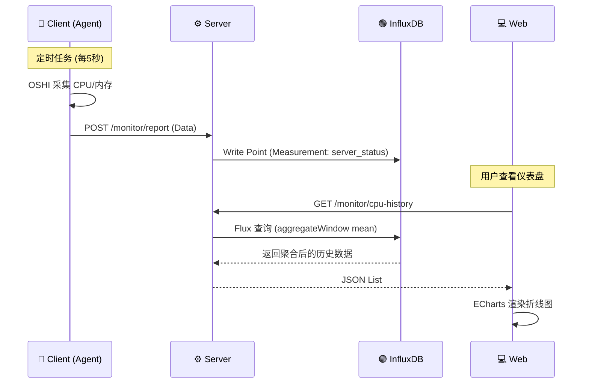
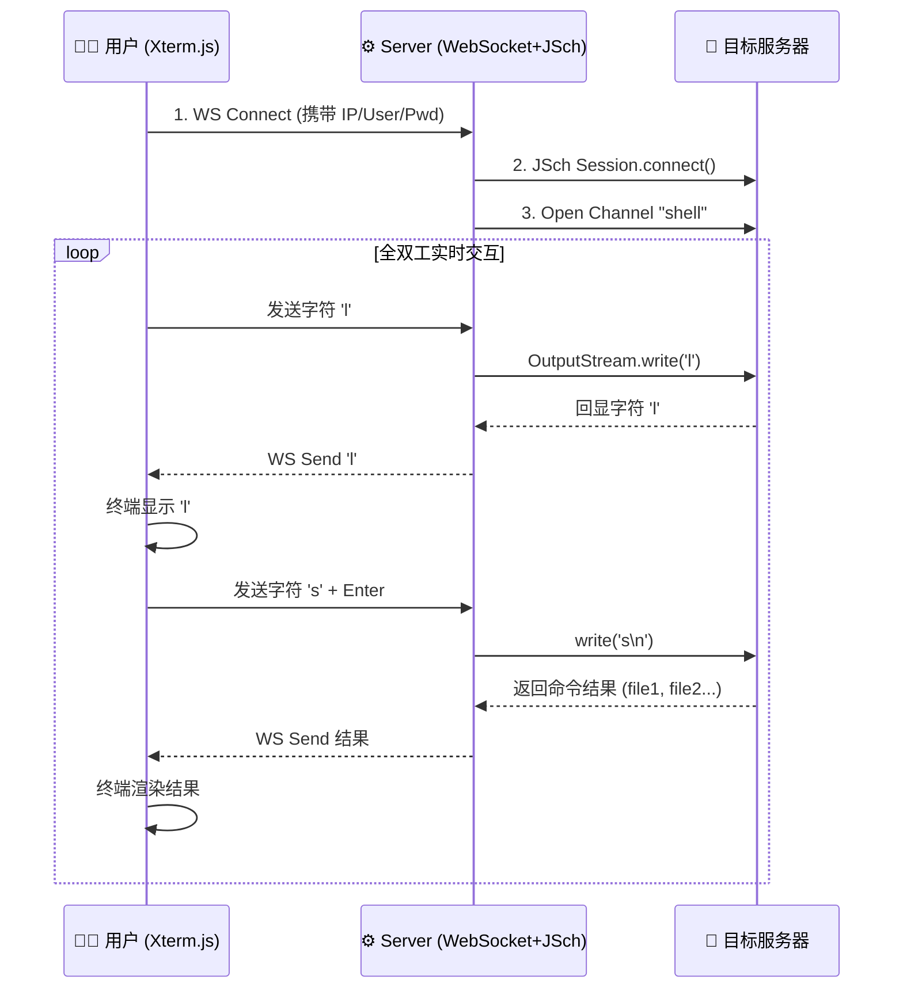

# 🚀 Monitor System - 分布式服务器运维监控平台

   

**Monitor System** 是一个轻量级、高性能的分布式服务器监控与运维平台。它采用标准的 Client-Server 架构，集成了服务器硬件状态实时监控、历史趋势分析以及 Web 端远程 SSH 控制功能，旨在为开发者提供一个开箱即用的运维解决方案。

---

## 📚 目录 (Table of Contents)

- [核心特性](#-核心特性-features)
- [技术栈](#-技术栈-tech-stack)
- [系统架构](#-系统架构-architecture)
- [核心流程图](#-核心流程-processes)
- [项目结构](#-项目结构-project-structure)
- [快速开始](#-快速开始-getting-started)
- [后续规划](#-后续规划-roadmap)

---

## ✨ 核心特性 (Features)

1.  **实时硬件监控**：
    *   基于 **OSHI** 深入操作系统底层，精准采集 CPU 利用率、内存使用情况、JVM 状态等核心指标。
    *   支持多台服务器（Client）同时上报，毫秒级数据刷新。

2.  **高性能时序存储**：
    *   引入 **InfluxDB 2.x** 处理高并发监控数据写入。
    *   利用时序数据库特性实现数据的自动过期（Retention Policy）和降采样聚合查询，避免随着时间推移导致查询变慢。

3.  **可视化仪表盘**：
    *   基于 **Vue 3 + ECharts** 构建现代化 SPA 页面。
    *   提供动态折线图展示 CPU/内存 历史趋势，支持时间范围筛选。

4.  **Web SSH 远程终端**：
    *   **“Web 版 Xshell”**：无需安装任何客户端，直接在浏览器中管理 Linux 服务器。
    *   基于 **WebSocket + JSch** 实现全双工低延迟通信，支持标准的 Shell 交互命令。

5.  **分布式架构**：
    *   **Monitor-Client (探针)**：轻量级设计，部署在目标服务器，负责采集与上报。
    *   **Monitor-Server (中枢)**：负责数据接收、存储、鉴权及 SSH 流量转发。

---

## 🛠 技术栈 (Tech Stack)

### 后端 (Backend)
| 技术 | 说明 | 作用 |
| :--- | :--- | :--- |
| **Spring Boot 3.3** | 核心框架 | 提供 IOC 容器、自动配置与 Web 服务能力 |
| **OSHI** | 硬件采集库 | 跨平台读取操作系统硬件信息 (CPU/Memory/Disk) |
| **InfluxDB Client** | 时序数据库 SDK | 连接 InfluxDB 2.x，处理监控数据的读写 |
| **MyBatis-Plus** | ORM 框架 | 简化 MySQL 操作，管理服务器基础信息 (CRUD) |
| **JSch** | SSH 协议库 | Java 实现的 SSH2 客户端，用于建立远程连接 |
| **Spring WebSocket** | 实时通信 | 实现 Web SSH 的前后端全双工通信 |

### 前端 (Frontend)
| 技术 | 说明 | 作用 |
| :--- | :--- | :--- |
| **Vue 3** | 前端框架 | Composition API 构建响应式用户界面 |
| **Vite** | 构建工具 | 极速冷启动与热更新 |
| **Element Plus** | UI 组件库 | 统一的界面风格与交互组件 |
| **ECharts** | 图表库 | 渲染高性能的动态折线图 |
| **Xterm.js** | 终端组件 | 在浏览器中模拟 Linux 终端界面 |

### 数据存储 (Database)
*   **MySQL 8.0**: 存储服务器列表、用户信息、告警规则等结构化数据。
*   **InfluxDB 2.7**: 存储 CPU、内存等带有时间戳的高频监控数据。

---

## 🏗 系统架构 (Architecture)

本系统采用经典的分层架构设计，前后端分离，数据流向清晰。

```mermaid
graph TD
    %% 定义样式
    classDef client fill:#e1f5fe,stroke:#01579b,stroke-width:2px;
    classDef server fill:#fff9c4,stroke:#fbc02d,stroke-width:2px;
    classDef db fill:#e8f5e9,stroke:#2e7d32,stroke-width:2px;
    classDef web fill:#f3e5f5,stroke:#7b1fa2,stroke-width:2px;

    subgraph User_Layer [用户交互层]
        Web[💻 Monitor-Web (Vue3 + Xterm.js)]:::web
    end

    subgraph Server_Layer [业务逻辑层]
        Gateway[🛡️ Controller / API]:::server
        SSH_Handler[🔌 WebSocket SSH Handler]:::server
        Monitor_Service[📊 Monitor Service]:::server
        SSH_Service[🔧 JSch Service]:::server
    end

    subgraph Storage_Layer [数据存储层]
        MySQL[(MySQL\n基础信息)]:::db
        InfluxDB[(InfluxDB\n时序监控数据)]:::db
    end

    subgraph Agent_Layer [被监控节点]
        Agent1[🤖 Monitor-Client 1]:::client
        Agent2[🤖 Monitor-Client 2]:::client
    end

    %% 关系连线
    Web -- "HTTP (查询数据/管理服务器)" --> Gateway
    Web -- "WebSocket (SSH操作)" --> SSH_Handler
    
    Gateway --> Monitor_Service
    Monitor_Service -- "读写历史数据" --> InfluxDB
    Monitor_Service -- "CRUD" --> MySQL
    
    SSH_Handler --> SSH_Service
    SSH_Service -- "SSH 协议 (TCP 22)" --> Agent1
    
    Agent1 -- "HTTP POST (定时上报)" --> Gateway
```

---

## 🔄 核心流程 (Processes)

### 1. 监控数据上报与查询流程
Client 端定时采集，Server 端接收并存入时序数据库，Web 端按需查询降采样数据。



### 2. Web SSH 远程控制流程
利用 WebSocket 实现浏览器与 Linux 底层 Shell 的全双工透传。



---

## 📂 项目结构 (Project Structure)

```text
monitor-project
├── monitor-common          # [公共模块] DTO对象、OSHI采集工具类
├── monitor-client          # [探针端] 运行在被监控服务器，定时采集上报
├── monitor-server          # [服务端] 核心API、InfluxDB存储、SSH逻辑
└── monitor-web             # [前端] Vue3 工程，包含 Dashboard 和 SSH 终端
```

---

## 🚀 快速开始 (Getting Started)

### 前置要求
*   **JDK**: 17+
*   **Node.js**: 18+ (推荐 v20.x)
*   **MySQL**: 8.0+
*   **InfluxDB**: 2.7.x (请勿使用 1.x 或 3.x)

### 1. 环境准备
1.  **MySQL**: 创建数据库 `monitor_db`，导入 `server_info` 建表语句。
2.  **InfluxDB**: 启动服务，创建 Bucket 名为 `monitor_bucket`，并获取 Token。

### 2. 后端配置 (monitor-server)
修改 `monitor-server/src/main/resources/application.yml`:
```yaml
spring:
  datasource:
    url: jdbc:mysql://localhost:3306/monitor_db...
    username: root
    password: your_password

influx:
  url: http://localhost:8086
  token: your_influx_token
  bucket: monitor_bucket
  org: your_org
```

### 3. 启动服务
1.  启动 `MonitorServerApplication` (端口 8080)。
2.  配置 `monitor-client` 的 `application.yml` 指向服务端地址，启动 `MonitorClientApplication` (端口 8081)。
3.  进入 `monitor-web` 目录：
    ```bash
    npm install
    npm run dev
    ```
4.  访问 `http://localhost:5173`。

---

## 🔮 后续规划 (Roadmap)

- [ ] **安全加固**: 集成 Spring Security + JWT 实现用户登录与权限控制。
- [ ] **告警系统**: 基于 CPU/内存阈值（如 >90%）发送邮件或钉钉告警。
- [ ] **Docker 支持**: 编写 Dockerfile 和 docker-compose.yml 实现一键部署。
- [ ] **多服务器适配**: 优化 Client 注册逻辑，支持动态添加监控节点。

---

**License**: MIT
