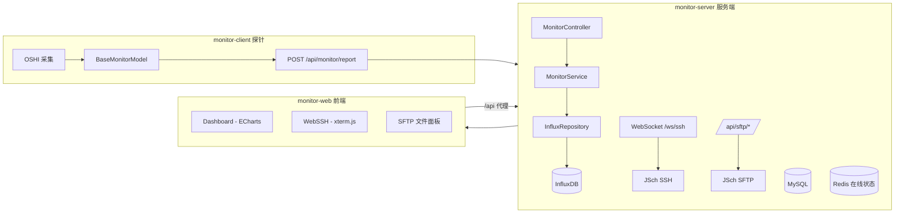

# 🚀 Monitor System | 分布式服务器运维监控平台


> **Monitor System** 是一个面向学习与实战的 **全栈运维监控平台**：
> - ✅ **性能监控**：monitor-client 探针采集（OSHI）→ monitor-server 写入 InfluxDB → Web 大屏可视化
> - ✅ **在线终端**：WebSSH（WebSocket + JSch + xterm.js）
> - ✅ **文件管理**：SFTP 远程上传/下载（JSch SFTP + 一次性 Ticket）
> - ✅ **鉴权体系**：双 Token 无感刷新 + 动态 RBAC（前后端联动）
>
> 如果你是初学者：建议先按本文的 **「快速启动」** 跑通，再按下方 **「模块技术文档导航」** 深入。

---

## 🧭 目录 (Contents)

- [✨ 功能总览](#-功能总览)
- [🏗️ 系统架构一图看懂](#-系统架构一图看懂)
- [📚 模块技术文档导航](#-模块技术文档导航)
- [📂 项目结构](#-项目结构)
- [🚀 快速启动（Windows cmd 友好）](#-快速启动windows-cmd-友好)
- [🧪 联调验证清单（最常见问题）](#-联调验证清单最常见问题)
- [🚦 默认端口与访问入口（速查）](#-默认端口与访问入口速查)
- [🧩 核心接口入口（新手最常用）](#-核心接口入口新手最常用)
- [🎯 最小功能体验路径（从 0 到完整体验）](#-最小功能体验路径从-0-到完整体验)
- [🔐 配置与安全提示（避免踩坑）](#-配置与安全提示避免踩坑)
- [🧠 新手学习建议：从哪看起最快？](#-新手学习建议从哪看起最快)
- [🔮 路线图](#-路线图)

---

## ✨ 功能总览

### 1) 🛡️ 安全鉴权（双 Token + 动态 RBAC）

- 登录后发放 **AccessToken + RefreshToken**，Access 过期自动刷新（无感）
- **RBAC 权限体系**：用户 → 角色 → 菜单/按钮
- 前端通过 `v-permission` 指令控制按钮显隐（与后端权限点保持一致）

### 2) 📊 性能监控（分布式 Agent + InfluxDB）

- `monitor-client` 周期采集：CPU/内存/磁盘/网络/负载/温度/Top5 进程
- `monitor-server` 写入 **InfluxDB**（时序）并提供历史查询（默认 10s 聚合）
- `monitor-web` Dashboard 支持 **实时刷新 + 历史回溯**（时间选择器）

### 3) 🖥️ WebSSH 在线终端（WebSocket + JSch）

- 浏览器直接操作远程服务器 Shell（xterm.js）
- 后端通过 JSch 建立 SSH Session/ChannelShell
- 支持基于 **一次性 Ticket 自动连接**（避免下发 SSH 明文凭证）

### 4) 📁 SFTP 文件上传/下载（JSch SFTP + Ticket）

- 前端上传（Multipart）/下载（Blob）
- 后端统一转发到远程服务器 SFTP
- 使用 **一次性 Ticket** 绑定用户，降低泄露与重放风险

---

## 🏗️ 系统架构一图看懂



---

## 📚 OpenAPI 文档与 Swagger UI（已集成）

> 目标：让你在本地启动后端后，可以直接通过浏览器查看并调试本项目的 HTTP API。
>
> 本项目使用 **springdoc-openapi** 将后端 Controller 自动生成 OpenAPI 文档，并提供 Swagger UI 页面。

### 1) 你能看到什么？（两种文档来源）

本仓库里有两份“API 文档来源”，用途不一样：

1. **运行时自动生成（推荐你调试用）**
   - 由 `monitor-server` 启动后自动生成
   - 优点：一定与当前代码一致，接口改了立刻反映

2. **仓库内的静态文档（便于阅读/对照）**
   - 根目录的 `openapi.yaml`
   - 用途：给同学/评审快速浏览接口契约；也方便前后端对齐

> 注意：`openapi.yaml` 不是 Swagger UI 的必需品。
> Swagger UI 默认展示的是后端运行时的 `/v3/api-docs`。

### 2) 后端侧是怎么接入的？（对应源码位置）

后端在 `monitor-project/monitor-server` 模块中接入：

- OpenAPI 基本信息配置：
  - `monitor-project/monitor-server/src/main/java/com/xu/monitorserver/config/OpenApiConfig.java`
  - 主要配置了：title / version / description / contact

- Swagger / OpenAPI 路径配置：
  - `monitor-project/monitor-server/src/main/resources/application.yml`
  - 关键配置（已存在）：
    - `springdoc.api-docs.path: /v3/api-docs`
    - `springdoc.swagger-ui.path: /swagger-ui.html`

### 3) 本地怎么访问 Swagger UI？

先启动后端（见本文「快速启动」），默认端口是 `8080`：

- Swagger UI：
  - http://localhost:8080/swagger-ui.html

- OpenAPI JSON（给前端/工具读取）：
  - http://localhost:8080/v3/api-docs

如果你想把 OpenAPI JSON 下载成文件：

```cmd
curl -o api-docs.json http://localhost:8080/v3/api-docs
```

### 4) 认证接口怎么调试？（带 JWT）

本项目大多数业务接口需要登录后的 JWT（Bearer Token）。推荐调试顺序：

1. 先调用登录接口：`POST /api/auth/login`
2. 从响应里拿到 `accessToken`
3. 在 Swagger UI 右上角 **Authorize** 中填写：

```text
Bearer <你的accessToken>
```

然后再去调试：

- 服务器资产：`/api/server/*`
- SFTP：`/api/sftp/*`
- RBAC 管理接口：`/api/admin/*`

### 5) 和前端联调有什么关系？

- 前端开发环境把 `/api` 代理到后端（Swagger UI 不走代理，直接是后端页面）
- 你在 Swagger UI 里调通了接口，基本就意味着前端 axios 能通

---

## 📚 模块技术文档导航

> 技术细节已经整理成模块级文档，建议按需阅读：

- `monitor-project/PERFORMANCE_MONITOR-MODULE.md`：性能监控（Agent/InfluxDB/前端大屏/联调步骤）
- `monitor-project/WebSSH_SERVERMANAGE-MODULE.md`：服务器资产管理 + WebSSH 终端（WS 协议、Ticket、JSch）
- `monitor-project/SFTP-MODULE.md`：SFTP 上传/下载（一次性 Ticket、安全策略、接口契约）
- `monitor-project/SECURITY-MODULE.md`：双 Token 无感刷新 + 动态 RBAC（前后端完整鉴权体系）

---

## 📂 项目结构

```text
GraduationProject (Root)
├── monitor-project/                 # Maven 父工程（后端）
│   ├── monitor-common/              # 公共模块（DTO/工具类/统一返回 R）
│   ├── monitor-client/              # Agent 探针（采集 + 上报 + 注册/心跳）
│   ├── monitor-server/              # 服务端（鉴权、监控、WebSSH、SFTP、RBAC）
│   ├── *.md                         # 模块技术文档（本仓库维护）
│   └── pom.xml
├── monitor-web/                     # 前端（Vue3 + Vite）
└── sql/                             # MySQL 初始化与升级脚本
```

---

## 🚀 快速启动（Windows cmd 友好）

> 目标：本地跑通 **monitor-server + monitor-web + InfluxDB + MySQL**，可选再跑 **Redis + monitor-client**。

### 0) 环境要求

- JDK 17+
- Maven（或使用各子模块自带 `mvnw.cmd`）
- Node.js 16+（建议 18 LTS 也可）
- MySQL 8+
- InfluxDB 2.x
- Redis（可选，但建议：用于 Agent 在线状态）

---

### 1) 初始化数据库（MySQL）

创建数据库：`monitor_db`，并按顺序执行 `sql/` 下脚本。

建议执行顺序（以仓库实际脚本为准）：

1. `01_init_structure.sql`
2. `02_add_user_profile.sql`
3. `03_rbac_upgrade.sql`
4. `04_update_rbac.sql`
5. `05_update_monitor.sql`
6. `06_add_server_ssh_private_key.sql`

---

### 2) 配置后端（monitor-server）

编辑：`monitor-project/monitor-server/src/main/resources/application.yml`

你通常只需要确认/修改这些：

- `spring.datasource.*`：MySQL 连接
- `influx.*`：InfluxDB 的 url/token/org/bucket
- `spring.data.redis.*`：Redis（如果你启用 Agent 在线状态）
- `monitor.app-secret`：Agent 注册/心跳鉴权 secret（client 需要保持一致）

---

### 3) 启动后端（monitor-server）

```cmd
cd /d D:\GraduationProject\monitor-project\monitor-server
mvnw.cmd spring-boot:run
```

后端默认端口：`8080`。

---

### 4) 启动前端（monitor-web）

```cmd
cd /d D:\GraduationProject\monitor-web
npm install
npm run dev
```

前端默认地址：

- http://localhost:5173

> 说明：前端 axios `baseURL=/api`，Vite 会把 `/api` 代理到 `http://localhost:8080`（见 `monitor-web/vite.config.js`）。

---

### 5)（可选）启动 Redis 并设置环境变量

后端 `application.yml` 中 Redis host/password 使用环境变量：`${REDIS_HOST}` / `${REDIS_PASSWORD}`。

如果你本地 Redis 在 `127.0.0.1:6379` 且无密码，可以在当前 `cmd` 窗口临时设置：

```cmd
set REDIS_HOST=127.0.0.1
set REDIS_PASSWORD=
```

然后再启动后端。

---

### 6)（可选）启动 monitor-client（Agent 探针）

编辑：`monitor-project/monitor-client/src/main/resources/application.yml`

至少确认：

- `monitor.server-base-url: http://<server-host>:8080`
- `monitor.server-url: http://<server-host>:8080/api/monitor/report`
- `monitor.app-secret` 与后端 `monitor.app-secret` 一致

启动：

```cmd
cd /d D:\GraduationProject\monitor-project\monitor-client
mvnw.cmd spring-boot:run
```

---

## 🧪 联调验证清单（最常见问题）

1) 前端能否访问： http://localhost:5173

2) 后端是否启动： http://localhost:8080

3) InfluxDB 是否可用：
- 后端日志无 Influx 连接异常

4) 如果你启动了 Agent：
- 后端能收到上报：`POST /api/monitor/report`
- Dashboard 曲线能出点

5) **最常见坑：ip 不一致导致查不到数据**
- 写入 tag ip 来自 Agent 的 `SystemMonitorUtil.getLocalIp()`
- 查询 ip 来自 MySQL 的 `server_info.ip`
- 两者不一致会导致：Influx 有数据但前端一直空

6) Agent 注册/心跳报 “App Secret 错误”
- `monitor-client.monitor.app-secret` 必须与 `monitor-server.monitor.app-secret` 一致

> 更详细的联调步骤与排错请看：`monitor-project/PERFORMANCE_MONITOR-MODULE.md`

---

## 🚦 默认端口与访问入口（速查）

| 组件 | 默认端口 | 说明 |
| :--- | :--- | :--- |
| `monitor-server` | `8080` | 后端 API 与 WebSocket 服务（见 `monitor-server/src/main/resources/application.yml`） |
| `monitor-web` | `5173` | 前端开发服务器（见 `monitor-web/vite.config.js`） |
| `monitor-client` | `8081` | Agent 自身启动端口（见 `monitor-client/src/main/resources/application.yml`，可不对外提供服务） |
| InfluxDB | `8086` | 时序数据库（见后端 `influx.url` 配置） |
| MySQL | `3306` | 业务数据库 |
| Redis | `6379` | Agent 在线状态与心跳 TTL |

### 前端请求为什么能到后端？（/api 代理规则）

- 前端 axios：`monitor-web/src/utils/request.js` 设置 `baseURL: '/api'`
- 所以请求 `'/monitor/cpu-history'` 实际发起：`/api/monitor/cpu-history`
- 开发环境代理：`monitor-web/vite.config.js` 把 `/api` 转发到 `http://localhost:8080`

---

## 🧩 核心接口入口（新手最常用）

> 以下均为后端 `monitor-server` 中真实存在的接口路径（已对齐源码 Controller）。

### 1) 认证（/api/auth）

- `POST /api/auth/register`：用户注册
- `POST /api/auth/login`：登录（返回 accessToken/refreshToken 等）
- `POST /api/auth/refresh`：刷新 Token（无感刷新用）

### 2) 服务器资产（/api/server）

- `GET  /api/server/list`：当前用户服务器列表
- `POST /api/server/save`：新增/更新服务器
- `DELETE /api/server/{id}`：删除服务器

与 WebSSH / SFTP Ticket 强相关的接口：

- `GET /api/server/{id}/ssh-config`：获取 WebSSH 连接配置（**仅返回 ticket，不下发明文凭证**）
- `GET /api/server/{id}/sftp-ticket`：获取 SFTP 文件操作 ticket（**一次性**）

### 3) 性能监控（/api/monitor）

- `POST /api/monitor/report`：Agent 上报监控数据（`BaseMonitorModel`）
- `GET  /api/monitor/base-info?ip=...`：Dashboard 顶部基础信息
- `GET  /api/monitor/cpu-history?ip=...&start=...&end=...`：CPU 曲线
- `GET  /api/monitor/disk-history?ip=...&start=...&end=...`：磁盘曲线
- `GET  /api/monitor/net-history?ip=...&start=...&end=...`：网络曲线
- `GET  /api/monitor/temp-history?ip=...&start=...&end=...`：温度曲线
- `GET  /api/monitor/load-history?ip=...`：负载多折线（一般用于实时）
- `GET  /api/monitor/disk-io-history?ip=...&start=...&end=...`：磁盘 IO 多折线

### 4) SFTP 文件管理（/api/sftp）

- `GET  /api/sftp/list?ticket=...&path=...`：列目录
- `POST /api/sftp/upload`：上传（multipart：ticket/targetDir/overwrite/file）
- `GET  /api/sftp/download?ticket=...&path=...`：下载（二进制流）

### 5) Agent 注册/心跳（/api/agent）

- `POST /api/agent/register`：Agent 启动注册（需要 Header `X-Monitor-App-Secret`）
- `POST /api/agent/heartbeat`：心跳续期（需要 Header `X-Monitor-App-Secret`）

> 注意：你们当前实现里，`/api/monitor/report` 并未强制校验 `X-Monitor-App-Secret`（文档已标注）。

---

## 🎯 最小功能体验路径（从 0 到完整体验）

> 这部分只写“你们项目里真实存在的功能链路”，不写假数据/假账号。

1. **启动依赖与服务**
   - MySQL / InfluxDB（以及可选 Redis）
   - `monitor-server` + `monitor-web`

2. **注册并登录**
   - 注册：`POST /api/auth/register`
   - 登录：`POST /api/auth/login`（前端登录页会自动调用）

3. **（可选但推荐）启动 Agent，让 Dashboard 有数据**
   - 启动 `monitor-client`
   - 确保它在上报：`POST /api/monitor/report`

4. **进入 Dashboard 观察监控曲线**
   - Dashboard 会调用：
     - `/api/monitor/base-info`
     - `/api/monitor/*-history`

5. **添加服务器资产并体验 WebSSH**
   - 资产列表：`GET /api/server/list`
   - 新增/修改：`POST /api/server/save`
   - 进入终端前先拿 ticket：`GET /api/server/{id}/ssh-config`
   - WebSocket：`/ws/ssh?token=<accessToken>`，并发送 `connect(ticket)`

6. **体验 SFTP 文件上传/下载**
   - 先拿 ticket：`GET /api/server/{id}/sftp-ticket`
   - 列目录：`GET /api/sftp/list`
   - 上传：`POST /api/sftp/upload`
   - 下载：`GET /api/sftp/download`

---

## 🔐 配置与安全提示（避免踩坑）

### 1) InfluxDB Token

`monitor-server/src/main/resources/application.yml` 中 `influx.token` 是访问 InfluxDB 的敏感信息。

建议：

- 开发环境可以先写在本地配置
- 生产环境建议用环境变量或配置中心注入

### 2) Agent 鉴权密钥（monitor.app-secret）

- 后端：`monitor.app-secret`
- Agent：`monitor.app-secret`

必须保持一致，否则 `/api/agent/register` 与 `/api/agent/heartbeat` 会抛出 “非法访问” 异常。

### 3) WebSSH/SFTP 凭证加密密钥（SSH_SECRET_KEY）

后端配置里存在：

- `monitor.crypto.ssh-secret-key: ${SSH_SECRET_KEY:}`

该值用于对数据库中保存的 SSH 凭证（密码/私钥/口令）进行 AES/GCM 加解密。

建议：

- 开发环境可以临时设置一个 Base64 的 32 字节随机 key
- 生产环境务必使用更安全的密钥管理方案，并定期轮换

---

## 🧠 新手学习建议：从哪看起最快？

1. 先跑通：本 README 的「快速启动」
2. 再看性能监控：`monitor-project/PERFORMANCE_MONITOR-MODULE.md`
3. 再看 WebSSH：`monitor-project/WebSSH_SERVERMANAGE-MODULE.md`
4. 再看 SFTP：`monitor-project/SFTP-MODULE.md`
5. 最后看鉴权体系：`monitor-project/SECURITY-MODULE.md`

---

## 🔮 路线图

- [x] 性能监控：CPU/内存/磁盘/网络/负载/温度 + InfluxDB
- [x] WebSSH：WebSocket 远程终端
- [x] SFTP：远程文件上传/下载
- [x] 安全鉴权：双 Token 无感刷新 + 动态 RBAC
- [ ] 告警中心：阈值告警（邮件/钉钉/飞书）
- [ ] Docker 部署：docker-compose 一键启动全套依赖

---

## 📄 许可证 (License)

MIT
