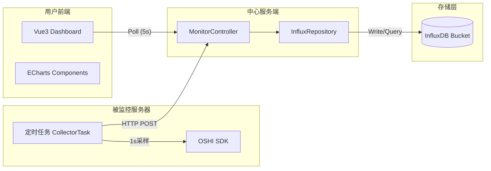
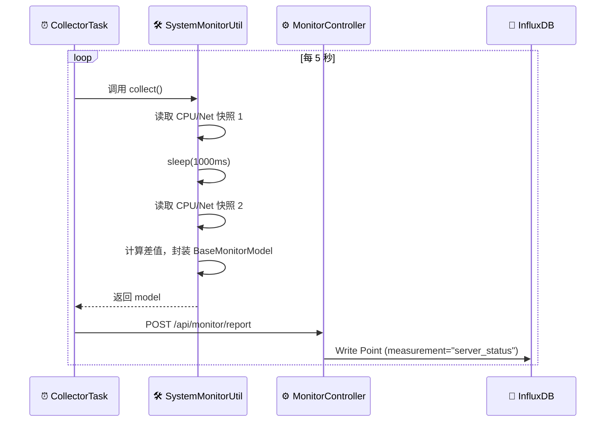
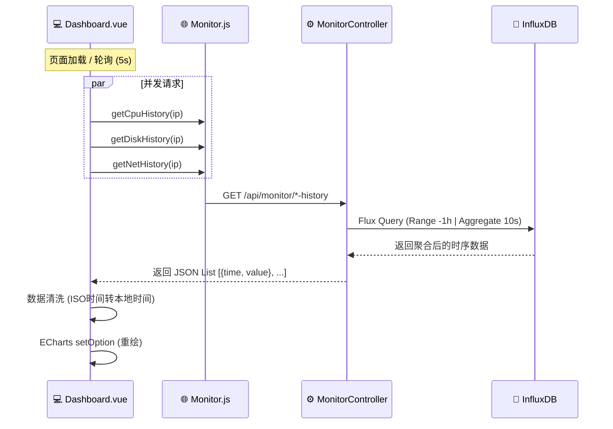

这是一份专门针对 **“服务器性能监控 (Performance Monitoring)”** 功能模块的深度技术文档。

我剥离了鉴权、SSH 等其他业务，专注于**数据采集、时序存储、前端渲染**这一条核心链路。

---

# 📊 服务器性能监控模块技术文档

> **模块名称**: Performance Monitor Module  
> **核心功能**: 实时采集服务器硬件指标、高频时序数据存储、可视化趋势图表展示  
> **关联服务**: Monitor-Client (探针), Monitor-Server (存储), InfluxDB (数据库)

---

## 🛠 1. 技术选型与架构 (Tech Stack)

本模块采用 **Agent-Based (探针式)** 监控架构，针对时序数据的特性进行了专门的技术选型。

### 1.1 核心技术组件
| 组件 | 技术栈 | 选型理由 |
| :--- | :--- | :--- |
| **数据采集** | **OSHI** (v6.4.x) | 纯 Java 实现的本地库，跨平台（支持 Linux/Windows/Mac），无需安装额外系统级依赖，能直接读取 CPU 滴答数、内存页等底层信息。 |
| **数据上报** | **RestTemplate** | Spring 内置 HTTP 客户端，轻量、稳定，适合定时任务中的同步发送。 |
| **数据存储** | **InfluxDB** (v2.7) | 专业时序数据库。写入吞吐量高，支持数据自动过期（Retention Policy），内置强大的 **Flux** 查询语言支持降采样（Downsampling）和聚合计算。 |
| **数据可视化** | **ECharts** (v5.x) | 百度开源图表库，性能优异，支持动态数据流渲染，适合绘制实时折线图。 |
| **并发处理** | **Java ThreadPool** | 在服务端异步处理入库逻辑；前端使用 `Promise.all` 并发请求多个指标接口。 |

### 1.2 数据流向架构


---

## ⚙️ 2. 功能实现原理 (Implementation)

### 2.1 硬件数据采集原理 (Client端)
硬件指标（特别是 CPU 和网络速率）不是瞬时值，而是**时间段内的变化率**。

*   **CPU 使用率计算**：
    1.  获取当前 CPU 总滴答数 (Total Ticks) 和 空闲滴答数 (Idle Ticks)。
    2.  `Thread.sleep(1000)` 休眠 1 秒。
    3.  再次获取新的 Total Ticks 和 Idle Ticks。
    4.  公式：`CPU% = 1 - (Idle2 - Idle1) / (Total2 - Total1)`。
*   **网络速率计算**：
    1.  获取网卡当前的 `BytesReceived` (下载总字节) 和 `BytesSent` (上传总字节)。
    2.  休眠 1 秒。
    3.  再次获取，计算差值。
    4.  公式：`Rate (KB/s) = (Bytes2 - Bytes1) / 1024`。

### 2.2 时序数据存储模型 (InfluxDB)
InfluxDB 采用 `Measurement` (表), `Tag` (索引), `Field` (数值), `Time` (时间戳) 的结构。

**设计 Schema (Measurement: `server_status`)**：

| 类型 | 字段名 | 说明 | 示例值 |
| :--- | :--- | :--- | :--- |
| **Tag** | `ip` | 服务器 IP (核心索引) | `192.168.100.128` |
| **Tag** | `os_name` | 操作系统名称 | `Ubuntu 22.04 LTS` |
| **Field** | `cpu_load` | CPU 使用率 (%) | `15.5` |
| **Field** | `disk_usage` | 磁盘使用率 (%) | `45.2` |
| **Field** | `net_recv_rate` | 网络下行速率 (KB/s) | `1024.5` |
| **Time** | `_time` | 采集时间 | `2025-12-12T10:00:00Z` |

### 2.3 降采样查询优化
为了防止前端渲染过多数据点导致卡顿，后端查询时使用了 Flux 语言的 **窗口聚合** 功能。

*   **策略**：将过去 1 小时的数据，按每 10 秒划分一个窗口，取窗口内的平均值 (`mean`)。
*   **效果**：即使数据库里有 3600 条数据（1秒1条），前端拿到的只有 360 个点，曲线更平滑且传输更快。

---

## 🔄 3. 核心业务流程 (Workflows)

### 3.1 数据上报链路 (Write Path)


### 3.2 数据查询与渲染链路 (Read Path)


---

## 📂 4. 模块文件结构 (Project Structure)

仅列出与监控模块强相关的文件。

```text
monitor-project
├── monitor-common
│   ├── moudule/BaseMonitorModel.java   # [DTO] 数据传输对象
│   └── utils/SystemMonitorUtil.java    # [核心] OSHI 采集工具类 (含IP获取逻辑)
│
├── monitor-client
│   └── task/CollectorTask.java         # [任务] 定时调度与上报
│
├── monitor-server
│   ├── controller/MonitorController.java # [接口] 接收上报 & 提供查询
│   ├── service/impl/MonitorServiceImpl.java # [业务] 调度 Repository
│   └── repository/InfluxRepository.java  # [DAO] InfluxDB Flux 查询封装
│
└── monitor-web (Frontend)
    ├── src/api/monitor.js              # [API] 定义 CPU/Disk/Net 接口
    ├── src/components/EchartsLine.vue  # [组件] 封装 ECharts 折线图
    └── src/views/dashboard/index.vue   # [页面] 监控大屏 (并发加载+轮询)
```

---

## 🚀 5. 功能扩展性 (Scalability)

当前模块设计预留了以下扩展空间：

1.  **多维度扩展**：
    *   目前的 `InfluxRepository` 使用通用的 `queryHistory(ip, field)` 方法。
    *   如果未来要监控 **JVM 堆内存** 或 **GPU 温度**，只需在 Client 端采集并在 `BaseMonitorModel` 加字段，后端无需修改查询逻辑，直接传新的 `field` 名称即可。

2.  **告警集成**：
    *   可以在 `MonitorController` 接收到数据的同时，增加一个 **异步事件**。
    *   如果 `cpu_load > 90`，触发 `AlertEvent`，由告警模块发送邮件或钉钉通知。

3.  **自定义时间范围**：
    *   目前的 Flux 查询写死为 `range(start: -1h)`。
    *   可以轻松改为接收前端参数 `startTime` 和 `endTime`，实现“查看昨天的数据”或“自定义时间段回放”。