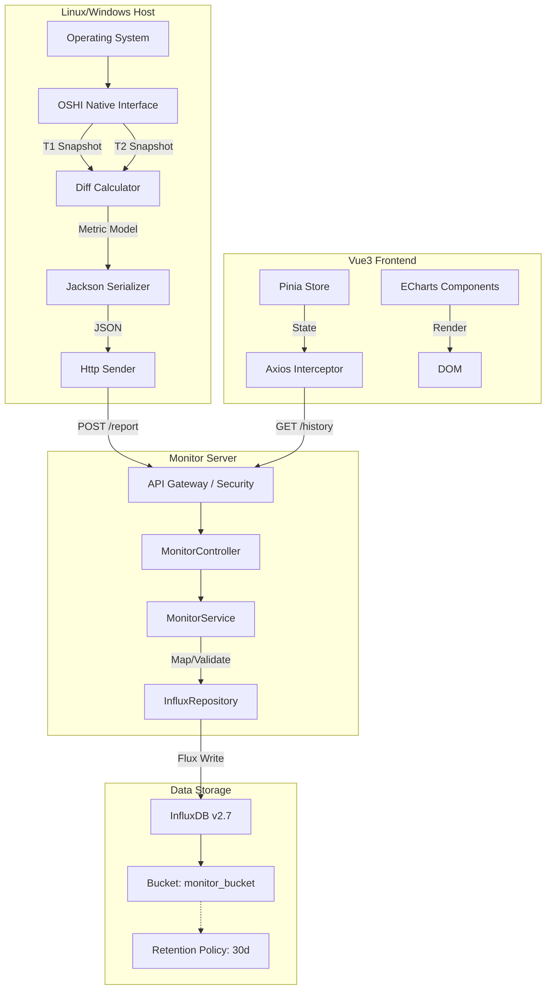
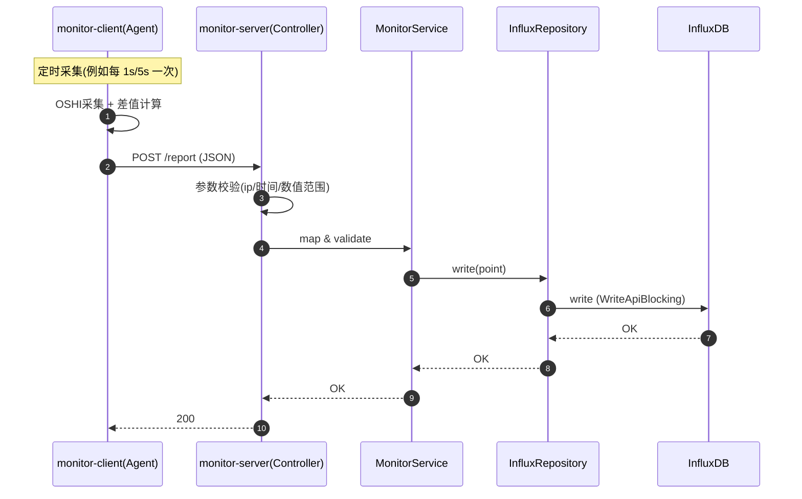

# 📊 服务器性能监控模块技术文档 v2.4

> **模块名称**：Performance Monitor Module
>
> **核心功能**：分布式硬件指标采集（Agent）+ 高频时序数据存储（InfluxDB）+ 多维可视化（ECharts）+ 历史回溯与降采样查询 + Agent 在线状态（Redis TTL）
>
> **技术关键词**：OSHI、InfluxDB v2(Flux)、Spring Boot Scheduler、InfluxDB Java Client(WriteApiBlocking/QueryApi)、Redis(在线状态)、Vue3 + Pinia、ECharts

---

## 📚 1. 体系概述 (Overview)

### 1.1 这个模块解决什么问题？

在“服务器运维/监控”场景里，我们通常希望做到：

- 实时看到 CPU、内存、磁盘、网络等核心指标
- 出现卡顿/故障时，可以回看历史曲线（例如过去 1 小时/24 小时）定位异常时间点
- 数据量很大时（秒级上报），页面仍然能顺畅渲染

本项目采用了经典的 **C/S（Client-Server）监控模式**：

1. **monitor-client（探针/Agent）**：部署在被监控机器上，负责采集指标、做少量本地计算（例如差值计算），然后通过 HTTP 上报
2. **monitor-server（服务端）**：负责接收上报、校验、写入 InfluxDB
3. **monitor-web（前端）**：负责查询历史数据并渲染图表

一句话总结：**端侧重采集，云端重存储；写入走高吞吐，查询走降采样**。

### 1.2 术语小词典（初学者友好）

- **OSHI**：Java 获取系统硬件信息的库（跨平台），可读 CPU/内存/磁盘/网卡等信息。
- **时序数据（Time Series）**：带时间戳的数据，例如每秒采集一次 CPU=35%。
- **InfluxDB**：专门用来存时序数据的数据库，写入快、按时间范围查询也很强。
- **Bucket**：InfluxDB 里存数据的“桶”，类似 MySQL 的 database。
- **Measurement**：InfluxDB 里的“表名”概念。
- **Tag / Field**：
  - Tag：索引字段（适合做过滤条件，比如 ip）
  - Field：指标字段（会随时间变化，比如 cpu_load）
- **Flux**：InfluxDB 的查询语言。
- **降采样（Downsampling）**：把高频数据合并成更少的点（例如 1 秒 1 点变 10 秒 1 点），避免前端渲染卡顿。

### 1.3 设计原则

- **轻量化探针 (Thin Agent)**：Client 不存历史数据，只负责采集/计算/上报，尽量不影响业务服务器
- **集中式存储 (Centralized Storage)**：所有时序数据汇总到 InfluxDB，统一查询
- **读写分离 (Read/Write Separation)**：
  - 写链路：Client → Server → InfluxDB
  - 读链路：Web → Server → InfluxDB
- **可视化友好**：查询侧通过降采样减少点数，前端更流畅

---

## 🏗 2. 深度技术架构 (Deep Dive Architecture)

### 2.1 架构分层（与源码路径对齐）

| 层 | 组件/文件 | 作用 |
| :--- | :--- | :--- |
| 采集端 | `monitor-project/monitor-client` | 周期性采集 OSHI 指标、差值计算、HTTP 上报 |
| 服务端 API | `monitor-project/monitor-server/src/main/java/com/xu/monitorserver/controller/MonitorController.java` | 提供 `/api/monitor/*` 接口：接收上报 + 查询历史 + 查询最新信息 |
| 服务端 Service | `monitor-project/monitor-server/src/main/java/com/xu/monitorserver/service/monitorservice/MonitorServiceImpl.java` | 业务编排：保存上报、按指标名调用 Repository 查询 |
| 数据访问 | `monitor-project/monitor-server/src/main/java/com/xu/monitorserver/repository/InfluxRepository.java` | 封装 InfluxDB 写入与 Flux 查询（固定 10s 窗口聚合） |
| InfluxDB 客户端配置 | `monitor-project/monitor-server/src/main/java/com/xu/monitorserver/config/InfluxDBConfig.java` | 创建 `InfluxDBClient`（url/token/org/bucket） |
| 存储层 | InfluxDB v2.x | bucket/measurement/tags/fields |
| 前端 | `monitor-web` + ECharts | 调用 `/api/monitor/*` 拉取数据并渲染 |

### 2.2 详细数据流图



### 2.3 关键“请求链路”时序图（从上报到落库）



---

## 🔌 3. 接口设计（API Contract）

> ✅ 下面的路径与参数来自实际源码。

### 3.1 监控数据接口（/api/monitor）

统一前缀：`/api/monitor`

#### 3.1.1 上报接口（写链路）

- **URL**：`POST /api/monitor/report`
- **Body**：`BaseMonitorModel`（位于 `monitor-project/monitor-common/src/main/java/com/xu/monitorcommon/moudule/BaseMonitorModel.java`）
- **用途**：探针把采集到的指标整体上报到服务端，服务端写入 InfluxDB
- **返回**：`R<Void>`（成功 `R.ok()`）

> ⚠️ 小提示：当前 `report` 接口本身没有做 `X-Monitor-App-Secret` 校验（你们的 app-secret 鉴权主要用在 Agent 注册/心跳）。

#### 3.1.2 历史曲线接口（读链路：按指标拆分）

- `GET /api/monitor/cpu-history?ip=...&start=...&end=...`
- `GET /api/monitor/disk-history?ip=...&start=...&end=...`
- `GET /api/monitor/net-history?ip=...&start=...&end=...`
- `GET /api/monitor/load-history?ip=...&start=...&end=...`
- `GET /api/monitor/disk-io-history?ip=...&start=...&end=...`
- `GET /api/monitor/temp-history?ip=...&start=...&end=...`

参数说明：

- `ip`：必填，InfluxDB 的 tag `ip`
- `start/end`：可选。
  - 不传时，后端默认 `start=-1h`、`end=now()`（见 `InfluxRepository.queryHistory`）
  - 支持 `-1h` 这类相对时间，也支持 `2025-12-16T10:00:00Z` 这类 ISO 时间

返回说明：

- 单指标接口（cpu/disk/net/temp）：`R<List<Map<String,Object>>>`（元素包含 `time/value`）
- 组合指标接口：
  - `/load-history`：`{ load1: [...], load5: [...], load15: [...] }`
  - `/disk-io-history`：`{ read: [...], write: [...] }`

#### 3.1.3 最新基础信息卡片（base-info）

- **URL**：`GET /api/monitor/base-info?ip=...`
- **用途**：Dashboard 顶部信息卡（最新 tags/容量/运行时长/Top进程等）
- **返回**：`R<Map<String,Object>>`

字段映射（来自 `InfluxRepository.queryLastOne`）：

- tags：`os_name/host_name/ip` → `osName/hostName/ip`
- fields：
  - `memory_total` → `memoryTotal`
  - `disk_total` → `diskTotal`
  - `up_time` → `uptime`
  - `top_processes` → `topProcesses`

### 3.2 Agent 生命周期接口（/api/agent）

统一前缀：`/api/agent`

> ✅ 源码位置：`monitor-project/monitor-server/src/main/java/com/xu/monitorserver/controller/AgentController.java`

#### 3.2.1 Agent 注册

- **URL**：`POST /api/agent/register`
- **Headers**：
  - `X-Monitor-App-Secret: <app-secret>`（常量：`AppConstants.MONITOR_APP_SECRET_HEADER`）
- **Body**：`AgentDTO.Register`
- **作用**：
  1. 校验 app-secret
  2. 在 Redis 写入在线 Key（TTL=60s）
  3. 在 MySQL `server_info` 中按 `agent_id` 查找：存在则更新，不存在则自动入库（Auto Discovery）

#### 3.2.2 Agent 心跳

- **URL**：`POST /api/agent/heartbeat`
- **Headers**：
  - `X-Monitor-App-Secret: <app-secret>`
- **Body**：`AgentDTO.Heartbeat`
- **作用**：校验 app-secret + 续期 Redis 在线状态 Key

---

## 💾 4. 数据模型与存储策略 (Data Model Strategy)

### 4.1 上报 DTO：BaseMonitorModel 字段字典（新手版）

源码位置：`monitor-project/monitor-common/src/main/java/com/xu/monitorcommon/moudule/BaseMonitorModel.java`

| 字段 | 类型 | 单位/范围 | 说明 |
| :--- | :--- | :--- | :--- |
| `agentId` | String | - | 探针唯一标识（client 在上报前注入） |
| `osName` | String | - | OS 名称（如 Windows/Linux） |
| `hostName` | String | - | 主机名 |
| `ip` | String | - | 本机 IP（util 会尽量取 192.168/10 段，否则 fallback） |
| `cpuLoad` | double | % (0~100) | CPU 使用率（通过两次采样差值计算） |
| `memoryTotal` | double | GB | 内存总量 |
| `memoryUsed` | double | GB | 已用内存 |
| `diskTotal` | double | GB | 磁盘总量（汇总所有分区） |
| `diskUsed` | double | GB | 已用磁盘 |
| `diskUsage` | double | % | 磁盘使用率 |
| `netRecvRate` | double | KB/s | 网络下行速率（两次采样差值） |
| `netSentRate` | double | KB/s | 网络上行速率（两次采样差值） |
| `systemLoad1/5/15` | double | - | 1/5/15 分钟系统负载（Windows 可能不支持，util 会处理负值） |
| `upTime` | long | 秒 | 系统运行时长 |
| `diskReadRate` | double | KB/s | 磁盘读取速率（两次采样差值） |
| `diskWriteRate` | double | KB/s | 磁盘写入速率（两次采样差值） |
| `topProcessesJson` | String | JSON | Top5 进程列表（JSON 字符串） |
| `cpuTemperature` | double | ℃ | CPU 温度（部分机器可能读不到，可能为 0） |

### 4.2 Client 端采集实现（真实源码对齐）

#### 4.2.1 指标采集：SystemMonitorUtil

源码位置：`monitor-project/monitor-common/src/main/java/com/xu/monitorcommon/utils/SystemMonitorUtil.java`

采集要点：

1. **基础信息**：osName/hostName/ip/upTime
2. **内存/磁盘容量**：把 Byte 转 GB，并格式化到 2 位小数
3. **速率类指标差值**：
   - `cpuLoad`：`getSystemCpuLoadBetweenTicks(prevCpuTicks)`
   - `netRecvRate/netSentRate`：对所有网卡的 bytes 求和后做差
   - `diskReadRate/diskWriteRate`：对所有磁盘的 read/write bytes 求和后做差
4. **Top5 进程**：按 CPU 排序取 5 条，序列化成 JSON 字符串
5. **CPU 温度**：`HAL.getSensors().getCpuTemperature()`

> 新手提示：这里用了一次 `TimeUnit.SECONDS.sleep(1)` 作为采样窗口，所以采集方法不适合在主线程里调用。

#### 4.2.2 定时上报：CollectorTask

源码位置：`monitor-project/monitor-client/src/main/java/com/xu/monitorclient/task/CollectorTask.java`

- 定时方式：`@Scheduled(fixedRateString = "${monitor.interval}")`
- 上报 URL：来自 `monitor.server-url`
- 上报工具：`RestTemplate.postForObject(serverUrl, data, String.class)`
- 上报前会注入 `agentId`：`data.setAgentId(agentIdentity.getAgentId())`

对应配置：`monitor-project/monitor-client/src/main/resources/application.yml`

- `monitor.server-url: http://<server>:8080/api/monitor/report`
- `monitor.interval: 5000`（5 秒一次）

#### 4.2.3 Agent 身份：AgentIdentity

源码位置：`monitor-project/monitor-client/src/main/java/com/xu/monitorclient/core/AgentIdentity.java`

- 首次启动生成 UUID，并写入 `agent.id`
- 后续启动从 `agent.id` 读取，确保同一个 Agent 实例身份稳定

#### 4.2.4 Agent 注册与心跳：AgentLifecycleTask

源码位置：`monitor-project/monitor-client/src/main/java/com/xu/monitorclient/task/AgentLifecycleTask.java`

- 每 30 秒执行一次：
  - 未注册：`POST /api/agent/register`
  - 已注册：`POST /api/agent/heartbeat`
- 鉴权方式：在 Header 里带 `X-Monitor-App-Secret: <app-secret>`
- 注册时会采集一次 SystemMonitorUtil.collect()，把 hostname/os/ip 发给服务端用于入库

> 注意：CollectorTask 上报监控数据时，并没有添加这个 header（当前实现是这样）。

---

## 🎛 5. 前端可视化实现（monitor-web 源码对齐）

### 5.1 Axios 请求封装与接口位置

- API 封装：`monitor-web/src/api/monitor.js`
  - `getCpuHistory/getDiskHistory/getNetHistory/getTempHistory`
  - `getSystemLoadHistory/getDiskIoHistory`
  - `getServerBaseInfo`

> 新手提示：这里的 url 写的是 `/monitor/*`（没有 `/api` 前缀），一般是因为前端 `request.js` 或代理配置会自动加上后端前缀。

### 5.2 Dashboard 页面如何拉取与渲染数据

源码位置：`monitor-web/src/views/dashboard/index.vue`

关键逻辑（读懂这些，你就能读懂整个页面为什么能动）：

1. `init()`：先拉服务器列表 `getServerList()` 并选中一个 IP
2. `startPolling()`：
   - `loadBaseInfo()`：请求 `getServerBaseInfo({ ip })`，并解析 `topProcesses` JSON
   - `loadChartsData()`：并发请求 6 组数据（Promise.all）
3. `timeRange` 选择器：
   - 选择后将 `start/end` 转换为 `toISOString()` 传给后端
   - 不选则默认 `-1h` 与 `now()`

---

## 🔐 6. 安全与鉴权说明（贴合当前实现）

### 6.1 app-secret 的用途是什么？

- 用于 **Agent 注册 / 心跳** 的简单鉴权
- Header Key：`X-Monitor-App-Secret`（`AppConstants.MONITOR_APP_SECRET_HEADER`）

### 6.2 Redis 在线状态是怎么实现的？

服务端：`AgentController.refreshOnlineStatus`（TTL 60 秒）

- Key：`agent:online:<agentId>`（前缀：`AppConstants.REDIS_AGENT_ONLINE_PREFIX`）
- Value：`1`
- TTL：60 秒

客户端：`AgentLifecycleTask` 每 30 秒心跳一次。

> 新手理解：只要心跳不断，Redis Key 就会不断续期 -> 代表在线。

---

## 🧯 7. 异常处理与容错机制

### 7.1 客户端容错（Agent 端）

- **网络中断**：HTTP 发送失败时，只记录日志，不退出进程；下一次定时任务继续上报
- **指标获取失败**：OSHI 在不同系统上支持度不同（例如 Windows 的 loadavg）。获取失败时填默认值，避免序列化失败

### 7.2 服务端容错（Server 端）

- **参数校验**：对 `ip`、数值范围、时间范围做基本校验
- **空数据**：InfluxDB 查询为空时返回空列表，前端渲染空图，不白屏
- **时间格式**：前端用 `new Date(isoStr)` 兼容 UTC/本地

---

## ⚡ 8. 性能与并发 (Concurrency)

### 8.1 Dashboard 为什么要并发加载多张图？

一个页面往往要同时拉：CPU、磁盘、网络、负载、温度等多条曲线。

- 前端使用 `Promise.all` 并发请求
- 后端 + InfluxDB client 支持并发查询

效果：从串行等待变成“只等最慢的那一个”。

### 8.2 客户端资源控制（避免 Agent 反向拖慢服务器）

- `SystemInfo` 与 `HardwareAbstractionLayer` 使用单例，避免重复初始化
- `ObjectMapper` 全局复用，避免频繁创建

---

## 🔍 9. 本地排错清单（按“从外到内”的顺序）

> 这一段是“都补齐”里最实用的部分：按你们项目的真实实现，一步步定位问题。

1. **Agent 是否生成了 agent.id？**
   - 在 client 运行目录下应看到 `agent.id` 文件

2. **Agent 注册是否成功？**
   - client 日志会打印 “Agent 注册成功”
   - server 日志会看到 `收到 Agent 注册请求`

3. **心跳是否在续？**
   - 每 30 秒一次心跳
   - Redis 中应能看到 `agent:online:<agentId>` 且 TTL 在变化

4. **监控数据是否上报成功？**
   - `monitor.server-url` 必须是完整的 `.../api/monitor/report`
   - 如果 server 没起来，CollectorTask 会打印 “发送失败, 服务端可能未启动”

5. **InfluxDB 是否写入成功？**
   - 检查 `influx.url/token/org/bucket` 配置
   - 后端写入使用 `WriteApiBlocking.writePoint(bucket, org, point)`

6. **前端查不到数据（返回空）最常见原因：ip 不一致**
   - Agent 上报的 `ip` 来自 `SystemMonitorUtil.getLocalIp()`
   - 前端查询的 `ip` 来自你们的服务器列表（MySQL 的 `server_info.ip`）
   - 如果两者不一致，就会出现：上报有数据，但查询永远为空

7. **温度/负载一直是 0？**
   - 某些平台或硬件没有暴露传感器/负载信息，这属于正常现象

---

## 🔮 10. 未来技术演进 (Future Tech)

1. **传输层升级**：HTTP 上报可升级为 gRPC / MQTT，降低延迟与开销
2. **数据层升级**：
   - Redis 缓存最新值，减少 InfluxDB `last()` 压力
   - 数据库层面做持续降采样（把秒级归档为分钟级）
3. **告警推断**：引入流式计算（Flink/Reactor）实现滑窗告警（如连续 5 分钟 CPU > 90%）

---

## 🧪 11. 本地启动与联调（急用版：照着做就能跑）

> 目标：你在一台开发机上把 **monitor-server + InfluxDB + Redis + monitor-web + monitor-client** 跑起来，并能在 Dashboard 看到曲线。
>
> 说明：下面命令以 Windows `cmd.exe` 为例；如果你用的是 PowerShell / Git Bash，只要把 `set` 和路径写法按各自习惯改一下即可。

### 11.1 关键前提：前端为什么请求的是 `/api/monitor/*`？

- 前端 axios 统一配置：`monitor-web/src/utils/request.js`
  - `baseURL: '/api'`
- 所以前端写 `url: '/monitor/cpu-history'`，实际请求会变成：
  - `GET /api/monitor/cpu-history`

开发环境代理：`monitor-web/vite.config.js`

- `'/api' -> http://localhost:8080`

所以最终会转发到后端：

- `http://localhost:8080/api/monitor/cpu-history`

> ✅ 这就是文档里“前端写 /monitor/*，后端是 /api/monitor/*”看起来不一致但其实能通的原因。

---

### 11.2 启动 InfluxDB（必须）

你需要一个 InfluxDB v2.x，并至少创建：

- Org：`my-org`
- Bucket：`monitor_bucket`
- Token：写到后端 `application.yml` 的 `influx.token`

后端配置文件位置：

- `monitor-project/monitor-server/src/main/resources/application.yml`

其中关键项：

- `influx.url`（默认 `http://localhost:8086`）
- `influx.token`
- `influx.org`
- `influx.bucket`

快速验证（思路）：

- 启动后能打开 InfluxDB UI
- 或者在后端启动后，看后端日志是否报 Influx 连接异常

---

### 11.3 启动 Redis（用于 Agent 在线状态，建议但不强制）

后端配置：

- `spring.data.redis.host: ${REDIS_HOST}`
- `spring.data.redis.password: ${REDIS_PASSWORD}`

> ⚠️ 常见坑：Windows 下如果你没设置环境变量，`${REDIS_HOST}` 可能为空导致连接失败。

最简单的做法（开发机本地 Redis、无密码）：

1) 在 `cmd` 里设置环境变量（只对当前窗口生效）：

```cmd
set REDIS_HOST=127.0.0.1
set REDIS_PASSWORD=
```

2) 启动后端。

验证在线 Key 的逻辑：

- Key：`agent:online:<agentId>`
- TTL：60s（心跳每 30s 会续期）

---

### 11.4 启动 monitor-server（后端）

建议从 `monitor-project/monitor-server` 启动。

```cmd
cd /d D:\GraduationProject\monitor-project\monitor-server
mvnw.cmd spring-boot:run
```

启动成功后，至少应满足：

- http://localhost:8080 可访问（或你配置的端口）
- `/api/monitor/*` 接口可被前端代理访问

---

### 11.5 启动 monitor-web（前端）

```cmd
cd /d D:\GraduationProject\monitor-web
npm install
npm run dev
```

默认 Vite 端口：`5173`。

打开页面：

- http://localhost:5173

---

### 11.6 启动 monitor-client（Agent）

配置文件：

- `monitor-project/monitor-client/src/main/resources/application.yml`

关键项（你至少要改 server 地址）：

- `monitor.server-base-url: http://<server-host>:8080`
- `monitor.server-url: http://<server-host>:8080/api/monitor/report`
- `monitor.app-secret: abc12345`（要与后端 `monitor.app-secret` 一致）
- `monitor.interval: 5000`

启动：

```cmd
cd /d D:\GraduationProject\monitor-project\monitor-client
mvnw.cmd spring-boot:run
```

你应该能在 client 日志看到：

- 采集成功（CPU/内存日志）
- 注册成功（首次）
- 之后每 30 秒一次心跳

---

### 11.7 验证清单（从外到内）

1) **后端是否启动**：8080 是否可访问
2) **前端代理是否生效**：前端请求 `/api/monitor/base-info` 是否返回（浏览器 Network 可看）
3) **client 是否注册成功**：后端日志 `收到 Agent 注册请求`
4) **Redis 是否有在线 key**：`agent:online:<agentId>` TTL 在走
5) **InfluxDB 是否有数据**：
   - client 正在 POST `/api/monitor/report`
   - 后端无 Influx 写入异常
6) **Dashboard 是否有数据**：
   - 选中服务器 IP 后曲线能出点

---

### 11.8 最常见联调问题（急救区）

- **问题 1：前端一直没数据，但后端接口正常**
  - 90% 是 `ip` 不一致：
    - 写入时用的 tag ip 来自 Agent 的 `SystemMonitorUtil.getLocalIp()`
    - 查询时用的 ip 来自 MySQL 的 `server_info.ip`
  - 解决思路：确保 `server_info.ip` 与 Agent 上报 ip 完全一致。

- **问题 2：Agent 注册/心跳报 500：非法访问 App Secret 错误**
  - 检查：
    - client 的 `monitor.app-secret`
    - server 的 `monitor.app-secret`
  - 必须一致。

- **问题 3：Redis 连接失败**
  - 检查是否设置了 `REDIS_HOST` 环境变量
  - 或者把后端 `application.yml` 改成固定值（开发期更省事）

- **问题 4：InfluxDB 写入/查询失败**
  - 常见原因：token/org/bucket 不匹配
  - 优先检查 `monitor-server/src/main/resources/application.yml` 的 influx 配置

- **问题 5：为什么 report 不校验 app-secret，会不会被刷？**
  - 当前实现确实如此（文档中已标注）。
  - 如果部署在公网，建议：
    - 给 `/api/monitor/report` 增加 header 校验，或
    - 放到网关层做白名单/内网限制。
