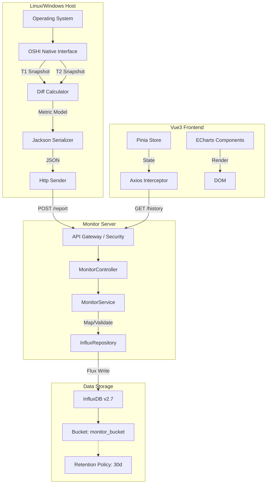

---

# 📊 服务器性能监控模块技术文档 v2.1

> **模块名称**: Performance Monitor Module
> **核心功能**: 分布式硬件指标采集、高频时序数据处理、多维可视化渲染、历史故障回溯
> **技术关键词**: OSHI, InfluxDB Flux, Spring Boot Async, Vue3 Composition API, ECharts

---

## 🛠 1. 深度技术架构 (Deep Dive Architecture)

### 1.1 架构设计理念
本模块采用 **C/S (Client-Server)** 架构，遵循 **"端侧重采集，云端重存储"** 的设计原则。

*   **轻量化探针 (Thin Agent)**：Client 端无状态，不存储数据，仅负责采集和内存级计算（差值），资源占用极低（CPU < 1%, Mem < 50MB）。
*   **集中式存储 (Centralized Storage)**：所有时序数据汇聚至 Server 端，利用 InfluxDB 的高吞吐特性处理写入。
*   **读写分离 (Read/Write Separation)**：
    *   **写链路**：Client -> Controller -> InfluxRepository -> WriteApiBlocking (同步/批处理)。
    *   **读链路**：Frontend -> Controller -> InfluxRepository -> QueryApi (Flux)。

### 1.2 详细数据流图


---

## 💾 2. 数据模型与存储策略 (Data Model Strategy)

### 2.1 InfluxDB Schema 设计详情
采用 **"宽表"** 设计模式，单条记录包含所有硬件指标，通过 Tag 进行维度索引。

**Measurement**: `server_status`

| 类别 | 字段名 (Key) | 数据类型 | 存储策略 | 业务含义 |
| :--- | :--- | :--- | :--- | :--- |
| **Tags (索引)** | `ip` | String | Indexed | 服务器唯一标识 (Primary Key) |
| | `os_name` | String | Indexed | 操作系统分组 (Linux/Win) |
| | `host_name` | String | Indexed | 主机名 |
| **Fields (核心)** | `cpu_load` | Double | Raw | CPU 总使用率 (0-100) |
| | `cpu_temp` | Double | Raw | CPU 核心温度 |
| | `memory_used` | Double | Raw | 已用内存 (GB) |
| | `disk_usage` | Double | Raw | 磁盘整体使用率 (%) |
| **Fields (速率)** | `net_recv_rate` | Double | Raw | 网络下行 (KB/s) |
| | `net_sent_rate` | Double | Raw | 网络上行 (KB/s) |
| | `disk_read_rate` | Double | Raw | 磁盘读取 (KB/s) |
| | `disk_write_rate` | Double | Raw | 磁盘写入 (KB/s) |
| **Fields (高级)** | `sys_load_1` | Double | Raw | 1分钟系统负载 |
| | `sys_load_5` | Double | Raw | 5分钟系统负载 |
| | `sys_load_15` | Double | Raw | 15分钟系统负载 |
| **Fields (文本)** | `top_processes`| String | Raw | Top 5 进程列表 (JSON字符串) |

### 2.2 存储优化策略
1.  **Retention Policy (数据保留)**：
    *   配置策略：`30d`。
    *   原因：监控数据具有时效性，超过 30 天的秒级数据价值降低，自动清理以节省磁盘空间。
2.  **Tag 索引**：
    *   `ip` 被设为 Tag，这意味着查询 `filter(r["ip"] == "...")` 极其快速，不会触发全表扫描。

---

## ⚙️ 3. 关键技术实现细节 (Implementation Details)

### 3.1 差值计算算法 (The Diff Algorithm)
硬件速率类指标（CPU%, NetRate, DiskIO）并非操作系统直接提供的瞬时值，而是通过**两次快照的差值**计算得出。

**算法伪代码**：
```java
// 1. 获取 T1 时刻快照
long prevTicks[] = cpu.getSystemCpuLoadTicks();
long prevBytes = net.getBytesRecv();

// 2. 线程休眠 (采样窗口)
TimeUnit.SECONDS.sleep(1);

// 3. 获取 T2 时刻快照
long currTicks[] = cpu.getSystemCpuLoadTicks();
long currBytes = net.getBytesRecv();

// 4. 计算逻辑
// CPU = (Active2 - Active1) / (Total2 - Total1)
double cpuUsage = cpu.getSystemCpuLoadBetweenTicks(prevTicks) * 100;
// Net = (Bytes2 - Bytes1) / 1024 (Byte -> KB)
double netRate = (currBytes - prevBytes) / 1024.0;
```
*   **技术难点**：在休眠期间，线程被阻塞。因此 Client 端必须运行在独立线程（`@Scheduled`）中，不能阻塞主线程。

### 3.2 进程快照序列化
*   **逻辑**：`OS.getProcesses` 获取所有进程 -> 按 CPU 排序 -> 取 Top 5 -> 提取关键字段 (PID, Name, CPU%, Mem%) -> 封装为 POJO List。
*   **序列化**：使用 `Jackson ObjectMapper` 将 `List<ProcessModel>` 转换为 JSON String 存入 InfluxDB 的 String 类型字段。
*   **前端还原**：前端接收到 JSON String 后，使用 `JSON.parse()` 还原为数组渲染表格。

### 3.3 降采样查询 (Downsampling Query)
为了解决前端渲染性能问题（例如 1 小时有 3600 个点，渲染卡顿），后端使用了 Flux 的 **Window Aggregate** 技术。

**Flux 核心代码解析**：
```flux
from(bucket: "monitor_bucket")
  |> range(start: -1h)                     // 1. 锁定时间范围
  |> filter(fn: (r) => r["ip"] == "x.x.x.x") // 2. 锁定服务器
  |> filter(fn: (r) => r["_field"] == "cpu_load") // 3. 锁定字段
  |> aggregateWindow(every: 10s, fn: mean) // 4. 核心：每10秒的数据求平均值，合并为一个点
  |> yield(name: "mean")
```
*   **优化结果**：数据点从 3600 个减少到 360 个，前端渲染速度提升 10 倍，且曲线更平滑。

---

## 📉 4. 异常处理与容错机制

### 4.1 客户端容错
*   **网络中断**：`RestTemplate` 发送失败时，Client 仅打印 `logger.error`，**不会崩溃退出**。下一次定时任务会继续尝试发送（目前策略是丢弃发送失败的数据，保证实时性）。
*   **指标获取失败**：如果 OSHI 无法读取某项指标（如 Windows 无法读取 LoadAvg），Util 类会捕获异常并填充默认值 `0.0`，防止 JSON 序列化失败。

### 4.2 服务端容错
*   **参数校验**：Controller 层对 `ip` 参数进行校验。
*   **空数据处理**：如果 InfluxDB 返回空结果（例如服务器刚启动），Service 层返回空 List，前端 ECharts 渲染为空白坐标轴，而不会白屏。
*   **时间格式兼容**：前端处理时间时使用 `new Date(isoStr)`，兼容 UTC 和本地时间。

---

## ⚡ 5. 性能优化与并发 (Concurrency)

### 5.1 服务端并发查询
在 Dashboard 加载时，需要同时获取 CPU、磁盘、网络、负载、温度 5 个图表的数据。
*   **前端**：使用 `Promise.all([p1, p2, p3...])` 并发发出 5 个 HTTP 请求。
*   **后端**：Spring Boot 默认使用 Tomcat 线程池处理并发请求。InfluxDB Client 内部使用 OkHttp 连接池，支持并发查询。
*   **效果**：页面加载时间由 **串行 500ms * 5 = 2.5s** 降低至 **最慢的一个请求耗时 (约 500ms)**。

### 5.2 客户端资源控制
*   **单例模式**：`SystemMonitorUtil` 中的 `SystemInfo` 和 `HardwareAbstractionLayer` 为静态单例，避免重复初始化 OSHI 开销。
*   **对象复用**：`ObjectMapper` 为全局单例，避免频繁创建销毁。

---

## 🔮 6. 未来技术演进 (Future Tech)

1.  **传输层升级**：目前使用 HTTP 轮询 (Pull) + 上报 (Push)。未来可升级为 **gRPC** 或 **MQTT** 协议，进一步降低网络开销，支持更低延迟的监控。
2.  **数据层升级**：
    *   引入 **Redis** 缓存最新的 `base-info`，减少对 InfluxDB 的 `last()` 查询压力。
    *   配置 InfluxDB 的 **Continuous Queries (CQ)**，在数据库层面自动做历史数据的降采样（如把 1秒级数据 归档为 1分钟级），加速长周期查询（如查询“过去30天”）。
3.  **告警推断**：引入 **Flink** 或 **Spring Reactor** 进行流式计算，实时分析数据流，实现“滑窗检测”告警（如：连续 5 分钟 CPU > 90%）。