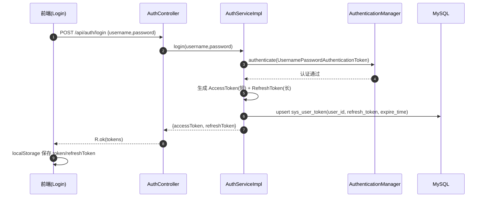
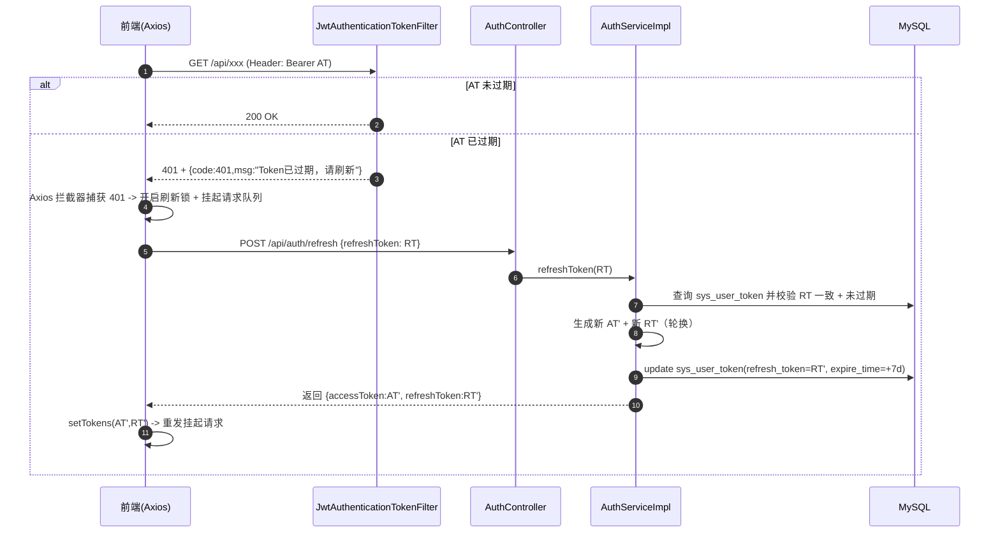

# 🛡️ 全栈用户鉴权体系（双 Token + 动态 RBAC）技术文档 v3.1

> **模块名称**：Security & Auth Module
>
> **核心功能**：双 Token 无感刷新登录态 + 动态 RBAC 权限控制（接口鉴权 + 按钮鉴权）
>
> **技术关键词**：Spring Boot 3.3、Spring Security 6、JWT、MyBatis-Plus、Vue3、Axios、Pinia、`@PreAuthorize`、`v-permission`

---

## 📚 1. 体系概述 (Overview)

### 1.1 这个模块解决什么问题？

做一个“需要登录”的系统，通常会遇到这些问题：

1. **怎么证明用户是谁？**（登录态）
2. **Token 过期怎么办？**（用户不想频繁掉线）
3. **不同角色能不能看到不同按钮？**（前端权限）
4. **不同角色能不能访问不同接口？**（后端权限）

本项目的选择是：

- 用 **JWT** 做无状态鉴权（后端不存 Session）
- 用 **双 Token**（AccessToken + RefreshToken）实现“无感刷新”
- 用 **RBAC（角色-权限）** 实现细粒度权限：
  - 后端：`@PreAuthorize` + `GrantedAuthority`
  - 前端：`v-permission` 指令控制按钮显示

> 一句话总结：
> - **AccessToken**：短期门票（访问接口用）
> - **RefreshToken**：长期身份证（AccessToken 过期时换新票用）

### 1.2 术语小词典（初学者可先看这里）

- **JWT**：一种字符串 token，里面带了用户名与过期时间，并用密钥签名。
- **AccessToken（AT）**：放在请求头 `Authorization: Bearer xxxx`，用于访问受保护接口。
- **RefreshToken（RT）**：只在“刷新 token”时用；本项目会把 RT 存进数据库用于校验与“强制下线”。
- **无感刷新**：AT 过期后，前端自动用 RT 换一个新 AT，不需要用户重新登录。
- **RBAC**：Role Based Access Control，通过“用户→角色→权限点”控制访问。
- **permission/perms**：权限标识字符串，例如 `server:delete`。

### 1.3 设计原则

- **无状态 (Stateless)**：后端不依赖 HTTP Session，扩容更容易。
- **Token 轮换 (Rotate RefreshToken)**：刷新成功会生成新的 AT 和新的 RT，并更新数据库。
- **权限前后端一致**：
  - 后端以 `GrantedAuthority` 为事实标准
  - 前端从 `/api/user/profile` 拿到权限列表，用于按钮控制

---

## 🏗 2. 深度技术架构 (Deep Dive Architecture)

### 2.1 架构分层

| 层 | 组件/文件 | 作用 |
| :--- | :--- | :--- |
| 前端请求层 | `monitor-web/src/utils/request.js` | Axios 实例 + 401 无感刷新 + 请求挂起队列 |
| 前端状态 | `monitor-web/src/stores/user.js` | 存储 token/refreshToken/userInfo，并提供 `setTokens()` |
| 前端权限指令 | `monitor-web/src/directive/permission.js` | `v-permission`：根据权限列表移除无权按钮 |
| 后端安全配置 | `SecurityConfiguration` | 放行登录/注册/刷新接口，其余接口必须登录；开启 `@EnableMethodSecurity` |
| 后端 JWT 过滤器 | `JwtAuthenticationTokenFilter` | 解析 AT → 写入 SecurityContext；AT 过期返回 401 |
| 后端登录/刷新 | `AuthController` + `AuthServiceImpl` | 登录签发双 Token；刷新校验数据库 RT 并轮换更新 |
| 后端权限加载 | `UserDetailServiceImpl` + `SysMenuMapper` | 登录时加载角色 + 根据角色查询权限点（sys_menu/sys_role_menu/sys_role） |
| 后端用户资料 | `UserController.getProfile()` | 从 SecurityContext 取 authorities 回传给前端（permission 列表） |
| 数据库 | `sys_user` + `sys_user_token` + RBAC 表 | 用户/RefreshToken/角色/权限点持久化 |

### 2.2 关键数据流（从登录到无感刷新）

#### 2.2.1 登录与双 Token 签发



#### 2.2.2 AccessToken 过期 → 前端无感刷新



---

## 🔌 3. 接口设计（API Contract）

> 说明：后端接口统一返回 `R<T>` 结构。

### 3.1 登录

- **URL**：`POST /api/auth/login`
- **Body**：`{ username, password }`
- **成功返回**：`{ accessToken, refreshToken }`

### 3.2 刷新（无感刷新专用）

- **URL**：`POST /api/auth/refresh`
- **Body**：`{ refreshToken }`
- **成功返回**：`{ accessToken, refreshToken }`（注意：这里会轮换生成新的 RT）

常见失败：

- RT 无效 / 不匹配数据库：提示“Refresh Token 已失效，请重新登录”
- RT 过期：提示“Refresh Token 已过期，请重新登录”

### 3.3 获取用户资料（含权限列表）

- **URL**：`GET /api/user/profile`
- **返回**：`SysUser`（其中 `permission` 字段为权限标识列表）

> 前端的 `v-permission` 指令会用 `userInfo.permission` 来决定“按钮是否显示”。

---

## 🧩 4. 核心实现说明（面向初学者的逐段讲解）

### 4.1 后端：SecurityConfiguration 做了什么？

对应文件：`monitor-server/src/main/java/com/xu/monitorserver/config/SecurityConfiguration.java`

关键点（按“你写项目最常踩坑”的顺序讲）：

1. **开启 CORS**：允许前端跨域请求（开发环境常见）
2. **关闭 CSRF**：否则很多 POST 会变 403
3. **无状态 Session**：`SessionCreationPolicy.STATELESS`
4. **白名单放行**：
   - `/api/auth/login`（登录）
   - `/api/auth/register`（注册）
   - `/api/auth/refresh`（刷新）
   - 以及 `/ws/**`、`/api/agent/**`、`/api/monitor/report`
5. **其他接口必须登录**：`.anyRequest().authenticated()`
6. **开启方法级权限**：`@EnableMethodSecurity`（让 `@PreAuthorize` 生效）

### 4.2 后端：JWT 过滤器如何让你“登录态生效”？

对应文件：`JwtAuthenticationTokenFilter`

它做的事情可以理解为三步：

1. 从请求头取 AT：`Authorization: Bearer <token>`
2. 从 token 解析出 username（如果过期会抛 `ExpiredJwtException`）
3. 把用户身份写到 Spring Security 上下文：`SecurityContextHolder.getContext().setAuthentication(...)`

**本项目的无感刷新触发点**就在这里：

- 一旦 AT 过期，过滤器会直接返回 `HTTP 401` + `R.fail(401, "Token已过期，请刷新")`
- 前端的 axios 拦截器捕获 401 后才会去调用 `/api/auth/refresh`

### 4.3 后端：为什么 RefreshToken 要落库？

对应表：`sys_user_token`

对应实现：`AuthServiceImpl.refreshToken()`

核心原因：

- JWT 自身是“无状态”的，如果只校验签名与过期时间，**之前签发过的 RT 只要没过期就一直能用**。
- 但我们需要：
  - 支持“强制下线”（让旧 RT 立刻失效）
  - 支持“轮换刷新”（每次刷新都换发新 RT，旧 RT 立即作废）

所以项目采取了：

- 登录时：把 RT 写进 `sys_user_token`
- 刷新时：
  1) 解析 RT 得到 username
  2) 查库拿到该用户当前保存的 RT
  3) **必须完全相等**才允许刷新
  4) 刷新成功后把库里的 RT 更新成新值

### 4.4 后端：RBAC 权限是怎么“动态加载”的？

对应实现：`UserDetailServiceImpl.loadUserByUsername()`

它会给当前用户构造一个 `authorities` 列表，里面包含两类内容：

1. **角色**：例如 `ROLE_ADMIN` / `ROLE_USER`
2. **权限点**：例如 `server:add`、`server:delete`

权限点查询来自：`SysMenuMapper.selectPermsByRoleCode(roleCode)`

```sql
SELECT m.perms
FROM sys_menu m
LEFT JOIN sys_role_menu rm ON m.id = rm.menu_id
LEFT JOIN sys_role r ON rm.role_id = r.id
WHERE r.role_code = #{roleCode}
  AND m.perms IS NOT NULL
```

### 4.5 后端：接口层怎么用 RBAC 做访问控制？

本项目使用了 Spring Security 的方法级注解：

- `@PreAuthorize("hasRole('ADMIN')")`

示例：`UserManageController` 整个控制器只允许管理员访问。

> 初学者提醒：
> - `hasRole('ADMIN')` 实际匹配的是 `ROLE_ADMIN`。
> - 角色来自 `UserDetailServiceImpl` 中 `authorities.add(new SimpleGrantedAuthority(sysUser.getRole()))`。

### 4.6 前端：无感刷新是怎么实现的？

对应文件：`monitor-web/src/utils/request.js`

核心策略：

- 所有请求统一走 axios 实例（`baseURL: '/api'`）
- 请求拦截器自动给请求加 `Authorization: Bearer token`
- 响应拦截器：
  - 若业务返回 `res.code === 401` 或 HTTP 状态码 401
  - 调用 `handleRefreshToken(config)`：
    - 用原生 axios 调 `/api/auth/refresh`
    - 刷新成功后 `userStore.setTokens(newAccess, newRefresh)`
    - 把刷新期间挂起的请求队列逐个重放

> 重点：这里做了“刷新锁 isRefreshing + requests 队列”，避免多个请求同时 401 时重复刷新。

### 4.7 前端：动态按钮权限（v-permission）怎么工作？

对应文件：`monitor-web/src/directive/permission.js`

逻辑非常直观：

- 指令写法：`v-permission="['server:delete']"`
- 指令执行时：
  - 先拿 `userStore.userInfo.role`
  - 再拿 `userStore.userInfo.permission`（后端 `/api/user/profile` 返回）
  - 若用户没有任一所需权限，则把按钮从 DOM 上移除

---

## 🔐 5. 安全设计与权限边界

### 5.1 哪些接口放行？哪些接口必须登录？

- 放行：登录/注册/刷新、WebSocket、Agent 上报等（见 `SecurityConfiguration`）
- 其他：全部需要登录（必须带 AT）

### 5.2 RBAC 在本项目里的“边界”

- **前端 v-permission**：只是“隐藏按钮”，不能当作真正安全。
- **后端 @PreAuthorize**：才是最终安全边界。

> 注意：不要把“前端按钮隐藏”理解为“安全”。
> - 真正的安全必须在后端做。
> - 所有敏感操作（删除/修改/管理后台）都要在后端加权限控制（例如 `@PreAuthorize`）。

### 5.3 已知限制与改进方向（可选）

- 目前 RefreshToken 表以 `user_id` 为主键：
  - 优点：实现简单
  - 限制：同一账号多端登录时会互相覆盖 RT
  - 可改进：增加 `device_id` 或 `token_id` 支持多端在线

---

## 🧪 6. 调试与排错指南（新手友好）

### 6.1 常见问题

| 现象 | 可能原因 | 建议排查 |
| :--- | :--- | :--- |
| 登录成功但调用接口 401 | 前端没带 Authorization，或 token 失效 | 看浏览器 Network 是否有 `Authorization: Bearer ...` |
| 很多请求同时报 401 | token 过期触发刷新流程 | 观察 `request.js` 是否只刷新一次（isRefreshing） |
| 刷新接口一直失败 | RT 不匹配数据库 / 已过期 | 查 `sys_user_token` 表里是否有对应 user_id 记录 |
| 管理员接口 403 | 当前用户没有 `ROLE_ADMIN` | 看 `/api/user/profile` 的 role，或数据库 sys_user.role |
| 按钮没显示 | `v-permission` 无对应权限 | 看 `/api/user/profile` 返回的 `permission` 列表 |

### 6.2 关键文件速查

- 后端：
  - `config/SecurityConfiguration.java`
  - `filter/JwtAuthenticationTokenFilter.java`
  - `service/authservice/AuthServiceImpl.java`
  - `service/sysuserservice/UserDetailServiceImpl.java`
  - `mapper/SysMenuMapper.java`
  - `controller/UserManageController.java`（`@PreAuthorize` 示例）
- 前端：
  - `src/utils/request.js`
  - `src/stores/user.js`
  - `src/directive/permission.js`

---

## ✅ 7. 本文档与代码的一致性说明

- AccessToken 有效期：`JwtUtils.ACCESS_EXPIRE = 1小时`
- RefreshToken 有效期：`JwtUtils.REFRESH_EXPIRE = 7天`
- 刷新接口：`POST /api/auth/refresh`（并且会轮换生成新的 RT）
- RBAC 权限来源：`sys_menu/sys_role_menu/sys_role` 三表联查（`SysMenuMapper.selectPermsByRoleCode`）
- 前端按钮控制：`v-permission` 使用 `/api/user/profile` 返回的 `permission` 列表

