# 🛡️ Monitor System | 全栈安全鉴权体系架构 v3.0

| 属性 | 说明                                                    |
| :--- |:------------------------------------------------------|
| **版本** | 3.0 (Double Token + RBAC + WebSSH)                    |
| **技术栈** | Spring Boot 3.3 + Spring Security 6 + JWT + WebSocket |
| **架构模式** | **RBAC** Level 3 / Stateless / **Silent Refresh**     |

---

## 📖 1. 体系概述 (Overview)

本系统采用现代化的 **前后端分离无状态鉴权体系**，已升级为商业级标准的 **双 Token 无感刷新机制** 与 **RBAC 动态权限控制**。

### 核心设计理念
1.  **双 Token 机制 (Double Token)**：
    *   **Access Token (门票)**：短效（如 15 分钟），用于高频 API 访问，无状态校验。
    *   **Refresh Token (身份证)**：长效（如 7 天），存储于数据库 (`sys_user_token`)，用于在 Access Token 过期时“无感”换取新票，支持**强制踢人下线**。
2.  **动态 RBAC (Dynamic Permission)**：
    *   后端动态返回权限标识（如 `server:delete`），前端通过自定义指令 `v-permission` 实现**按钮级**的细粒度控制。
3.  **WebSSH 安全通道**：
    *   利用 WebSocket 实现全双工通信，通过 URL 携带 Token 进行握手鉴权，并在建立连接后使用 JSON 协议传输 SSH 认证信息，避免敏感信息泄露。

---

## 🏗 2. 核心组件角色 (Component Roles)

下表详细定义了系统中各个 Java 类的职责与作用：

| 组件类名 | 对应角色 | 核心职责 |
| :--- | :--- | :--- |
| **SysUserToken** | **签证中心** | 数据库表，持久化存储 Refresh Token，用于状态管控与强制下线。 |
| **UserDetailsServiceImpl** | **翻译官** | 加载用户信息，并根据角色查询 `sys_menu` 表加载动态权限列表 (`permissions`)。 |
| **JwtAuthenticationTokenFilter** | **HTTP 安检门** | 拦截请求校验 Token。**关键升级**：捕获 `ExpiredJwtException` 时直接返回 **401** 状态码，触发前端刷新流程。 |
| **AuthServiceImpl** | **业务核心** | 处理登录（生成双 Token）、刷新（校验旧 Token -> 轮换生成新 Token -> 更新数据库）。 |
| **AuthHandshakeInterceptor** | **WS 门童** | 拦截 WebSocket 握手请求，从 URL 参数提取 Token 进行初步鉴权。 |
| **WebSshWebSocketHandler** | **SSH 协议官** | 建立连接后，解析前端发来的 JSON 数据包（含 Linux 账号密码），调度 SSH 服务。 |

---

## 🔄 3. 核心业务流程 (Workflows)

### 3.1 双 Token 登录与无感刷新流程 (Silent Refresh) 🔥
解决 Token 过期导致用户体验中断的问题。

```mermaid
sequenceDiagram
    autonumber
    participant Client as 💻 前端 (Axios)
    participant Filter as 🚧 JwtFilter
    participant AuthSvc as ⚙️ AuthService
    participant DB as 💾 MySQL

    Note over Client: 1. 登录阶段
    Client->>AuthSvc: POST /api/auth/login
    AuthSvc->>DB: 验证通过 -> 生成 AT(15m) & RT(7d) -> 存入 sys_user_token
    AuthSvc-->>Client: 返回 { accessToken, refreshToken }
    Client->>Client: 存入 LocalStorage

    Note over Client: 2. 正常请求
    Client->>Filter: GET /api/monitor/cpu (Header: Bearer AT)
    Filter->>Filter: 校验通过 -> 放行
    Filter-->>Client: 返回数据 (200 OK)

    Note over Client: 3. 无感刷新阶段
    Client->>Filter: GET /api/monitor/cpu (AT 已过期)
    Filter->>Filter: 捕获 ExpiredJwtException
    Filter-->>Client: ❌ 返回 401 Unauthorized
    
    Client->>Client: Axios 拦截器捕获 401 -> **挂起请求** -> 开启锁
    Client->>AuthSvc: POST /api/auth/refresh (Body: RT)
    AuthSvc->>DB: 校验 RT 是否有效/未被封禁
    
    alt 刷新成功
        AuthSvc->>AuthSvc: 轮换生成新 AT' & RT'
        AuthSvc->>DB: 更新数据库记录
        AuthSvc-->>Client: 返回新双 Token
        Client->>Client: 更新本地存储 -> **重发挂起的请求**
        Client->>Filter: GET /api/monitor/cpu (Header: Bearer AT')
        Filter-->>Client: 返回数据 (200 OK)
    else 刷新失败 (RT 过期/被踢)
        AuthSvc-->>Client: 返回 403
        Client->>Client: 清空存储 -> 强制跳转登录页
    end
```



### 3.2 RBAC 动态权限加载流程
实现“不同角色的用户看到不同的按钮”。

```mermaid
sequenceDiagram
    autonumber
    participant User as 👤 用户
    participant API as ⚙️ UserProfile API
    participant SVC as 🔍 UserDetailsSvc
    participant DB as 💾 MySQL

    User->>API: GET /api/user/profile
    API->>SVC: 获取当前用户
    SVC->>DB: 联表查询 (User -> Role -> RoleMenu -> Menu)
    DB-->>SVC: 返回权限标识列表 (如 ['server:list', 'server:delete'])
    SVC-->>API: 填充 permissions 字段
    API-->>User: 返回 UserInfo + Permissions
    
    Note right of User: 前端指令 v-permission<br>根据列表移除无权按钮
```



### 3.3 WebSSH WebSocket 鉴权与交互流程 (Special Case) 🔌
由于 WebSocket 无法使用 HTTP Header 鉴权，且涉及敏感的 SSH 认证信息传输，本系统采用：

- **第一层：握手鉴权（Token）**：WebSocket URL 携带 Access Token，仅用于建立 WS 通道的身份校验。
- **第二层：SSH 认证（双方案）**：连接建立后，通过 JSON 协议发起 SSH 登录，支持两种认证方式：
  - **用户名 + 密码 (password)**
  - **用户名 + 私钥 (publickey / key)**

> 设计目标：在不牺牲体验（Web 端即时终端）的前提下，提供更接近生产环境的 SSH 登录方式（尤其是密钥登录），并让前端能够给出“可读、可定位”的失败提示。

#### 3.3.1 双认证方案：协议字段与能力矩阵
**前端 -> 后端** 建议统一使用一套 `connect` 报文，通过 `authType` 区分认证模式。

| 字段 | 类型 | 必填 | 说明 |
| :--- | :--- | :---: | :--- |
| `operate` | string | ✅ | 固定为 `connect` |
| `host` | string | ✅ | 目标主机 IP/域名 |
| `port` | number | ❌ | SSH 端口，默认 22 |
| `username` | string | ✅ | Linux 用户名 |
| `authType` | string | ✅ | `password` / `privateKey` |
| `password` | string | 🔁 | `authType=password` 时必填 |
| `privateKey` | string | 🔁 | `authType=privateKey` 时必填（建议为 PEM 文本/或者前端上传后转文本） |
| `passphrase` | string | ❌ | 私钥口令（加密私钥时使用） |

> ✅ 可扩展：如果将来要支持“密钥文件上传”，也可以保持协议不变，仅把 `privateKey` 的来源从“文本”变成“文件读取后的文本”。

#### 3.3.2 时序：握手鉴权 + connect 登录（双认证）

```mermaid
sequenceDiagram
    autonumber
    participant Xterm as 🖥️ Xterm.js
    participant Interceptor as 🕵️ AuthHandshakeInterceptor
    participant JWT as 🎫 JwtUtils
    participant Handler as 🔌 WebSshHandler
    participant Service as 🔧 SshServiceImpl (JSch)

    Note over Xterm: 1. 握手鉴权 (Token 校验)
    Xterm->>Interceptor: WS Connect ws://host/ws/ssh?token=AT...
    Interceptor->>Interceptor: request.getParameter("token")

    alt Token 无效/过期
        Interceptor-->>Xterm: 握手失败 (连接断开)
    else Token 有效
        Interceptor->>JWT: extractUsername(token)
        JWT-->>Interceptor: 返回 username
        Interceptor->>Handler: 握手成功 (Connection Established)
    end

    Note over Xterm: 2. SSH 连接初始化 (JSON 协议: connect)
    Xterm->>Handler: 发送 JSON: { operate: "connect", host, port, username, authType, ... }
    Handler->>Service: initConnection(...)

    alt authType = password (用户名密码)
        Service->>Service: session.setPassword(password)
        Service->>Service: session.connect()
    else authType = privateKey (用户名密钥)
        Service->>Service: jsch.addIdentity(privateKey, passphrase)
        Service->>Service: session.connect()
    end

    Service-->>Xterm: 推送连接结果/欢迎语 (Stream)

    Note over Xterm: 3. 实时交互
    loop 全双工 Shell 交互
        Xterm->>Handler: 发送 JSON: { "operate": "command", "command": "ls" }
        Handler->>Service: recvClientCommand()
        Service->>Service: 写入 SSH OutputStream
        Service-->>Xterm: 读取 SSH InputStream -> 推送 WebSocket
    end
```



#### 3.3.3 JSch 实现要点（为什么需要“认证类型”）
在 JSch 里，密码登录与密钥登录的差异核心在于：

- **密码登录**：`session.setPassword(password)`
- **密钥登录**：`jsch.addIdentity(privateKey, passphrase)`（或 `addIdentity(path)`）

并且两者会触发不同的失败场景：

- 用户名/密码错误（`Auth fail`）
- 私钥无效（格式不对、缺少 header、内容被裁剪）
- 私钥口令错误（密钥被加密但 passphrase 不正确）
- 服务器拒绝密钥认证（sshd 配置不允许 `publickey` 或未配置 `authorized_keys`）

因此在 JSON 协议中用 `authType` 显式标明认证方式，能让后端在连接前做必要校验（字段是否齐全、私钥格式基本校验），也能让前端在 UI 上给出对应输入项与错误提示。

#### 3.3.4 失败提示：让前端“准确提示”的数据结构建议
为了避免前端只能展示一条“连接失败”，推荐后端在 WS 返回中携带结构化错误信息（**不要求一定暴露底层异常堆栈**）。

建议的后端 -> 前端错误报文：

```json
{
  "operate": "connect",
  "success": false,
  "errorCode": "SSH_AUTH_FAILED",
  "message": "SSH 认证失败：用户名或凭证不正确",
  "detail": "Auth fail"
}
```

- `errorCode` 用于前端做细分提示、国际化、多语言。
- `message` 面向用户，建议简洁可读。
- `detail` 便于开发排查，可根据环境控制是否返回（生产环境可选隐藏/降级）。

---

## 💾 4. 数据库设计 (Database Schema)

系统包含 5 张核心表，支撑 RBAC 与 Token 管理。

```sql
-- 1. 用户表 (增加逻辑删除)
CREATE TABLE `sys_user` (
  `id` bigint PRIMARY KEY AUTO_INCREMENT,
  `username` varchar(64) NOT NULL,
  `password` varchar(128) NOT NULL,
  `role` varchar(50) DEFAULT 'ROLE_USER',
  `deleted` tinyint(1) DEFAULT 0 COMMENT '逻辑删除'
);

-- 2. 用户 Token 表 (用于刷新与强制下线)
CREATE TABLE `sys_user_token` (
  `user_id` bigint PRIMARY KEY,
  `refresh_token` varchar(512) NOT NULL,
  `expire_time` datetime NOT NULL
);

-- 3. 角色表 & 4. 菜单表 & 5. 关联表 (RBAC 标准模型)
-- ... (sys_role, sys_menu, sys_role_menu)
```

---

## 📂 5. 关键代码目录结构

```text
monitor-server/src/main/java/com/monitor/server
├── config
│   ├── SecurityConfiguration.java   # 配置 401 异常处理, 放行 /auth/refresh
│   └── WebSocketConfig.java         # 注册 WS 拦截器
├── controller
│   ├── AuthController.java          # 登录、注册、刷新 Token
│   └── UserManageController.java    # 管理员专用接口
├── filter
│   └── JwtAuthenticationTokenFilter.java # 核心：过期返回 401
├── handler
│   └── WebSshWebSocketHandler.java  # 处理 JSON 协议与 SSH 调度
├── service
│   └── impl
│       ├── AuthServiceImpl.java     # 双 Token 业务逻辑
│       └── SshServiceImpl.java      # JSch 底层连接实现
└── utils
    └── JwtUtils.java                # Token 生成工具
```

---

## 🛡️ 6. 安全扩展性思考 (Future Work)

1.  **多端登录管理**：目前 `sys_user_token` 主键是 `user_id`，限制了单端登录。改为联合主键可支持多端同时在线。
2.  **操作日志审计**：引入 AOP 切面，记录用户的敏感操作（如删除服务器、重置密码）到 `sys_oper_log` 表。
3.  **IP 黑名单**：在 Filter 层增加 IP 校验，防止恶意爆破。