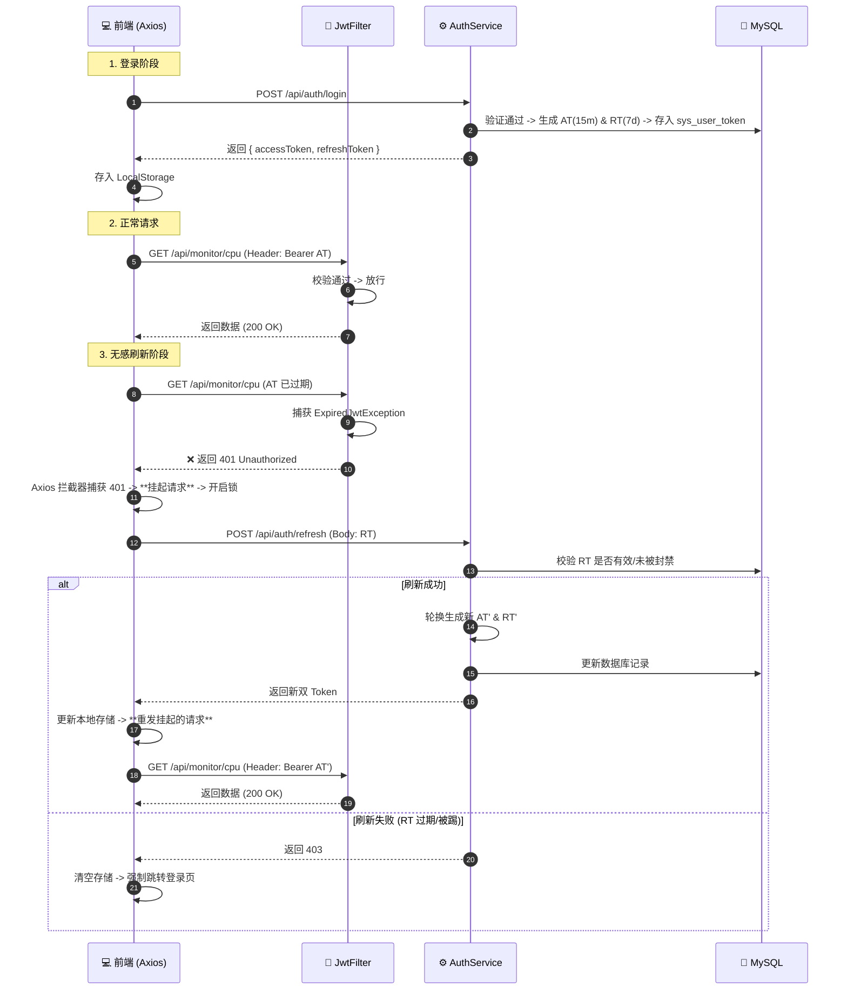
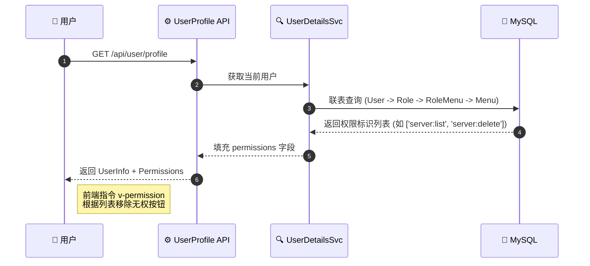
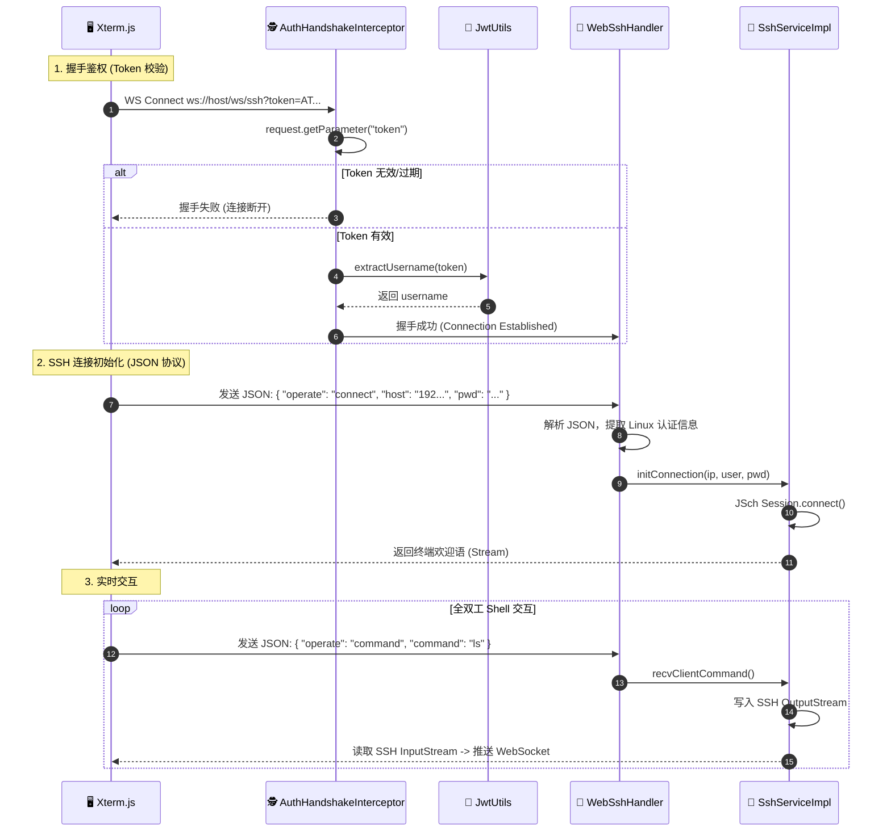

# 🛡️ Monitor System | 全栈安全鉴权体系架构 v3.0

| 属性 | 说明                                                    |
| :--- |:------------------------------------------------------|
| **版本** | 3.0 (Double Token + RBAC + WebSSH)                    |
| **技术栈** | Spring Boot 3.3 + Spring Security 6 + JWT + WebSocket |
| **架构模式** | **RBAC** Level 3 / Stateless / **Silent Refresh**     |

---

## 📖 1. 体系概述 (Overview)

本系统采用现代化的 **前后端分离无状态鉴权体系**，已升级为商业级标准的 **双 Token 无感刷新机制** 与 **RBAC 动态权限控制**。

### 核心设计理念
1.  **双 Token 机制 (Double Token)**：
    *   **Access Token (门票)**：短效（如 15 分钟），用于高频 API 访问，无状态校验。
    *   **Refresh Token (身份证)**：长效（如 7 天），存储于数据库 (`sys_user_token`)，用于在 Access Token 过期时“无感”换取新票，支持**强制踢人下线**。
2.  **动态 RBAC (Dynamic Permission)**：
    *   后端动态返回权限标识（如 `server:delete`），前端通过自定义指令 `v-permission` 实现**按钮级**的细粒度控制。
3.  **WebSSH 安全通道**：
    *   利用 WebSocket 实现全双工通信，通过 URL 携带 Token 进行握手鉴权，并在建立连接后使用 JSON 协议传输 SSH 认证信息，避免敏感信息泄露。

---

## 🏗 2. 核心组件角色 (Component Roles)

下表详细定义了系统中各个 Java 类的职责与作用：

| 组件类名 | 对应角色 | 核心职责 |
| :--- | :--- | :--- |
| **SysUserToken** | **签证中心** | 数据库表，持久化存储 Refresh Token，用于状态管控与强制下线。 |
| **UserDetailsServiceImpl** | **翻译官** | 加载用户信息，并根据角色查询 `sys_menu` 表加载动态权限列表 (`permissions`)。 |
| **JwtAuthenticationTokenFilter** | **HTTP 安检门** | 拦截请求校验 Token。**关键升级**：捕获 `ExpiredJwtException` 时直接返回 **401** 状态码，触发前端刷新流程。 |
| **AuthServiceImpl** | **业务核心** | 处理登录（生成双 Token）、刷新（校验旧 Token -> 轮换生成新 Token -> 更新数据库）。 |
| **AuthHandshakeInterceptor** | **WS 门童** | 拦截 WebSocket 握手请求，从 URL 参数提取 Token 进行初步鉴权。 |
| **WebSshWebSocketHandler** | **SSH 协议官** | 建立连接后，解析前端发来的 JSON 数据包（含 Linux 账号密码），调度 SSH 服务。 |

---

## 🔄 3. 核心业务流程 (Workflows)

### 3.1 双 Token 登录与无感刷新流程 (Silent Refresh) 🔥
解决 Token 过期导致用户体验中断的问题。



### 3.2 RBAC 动态权限加载流程
实现“不同角色的用户看到不同的按钮”。



### 3.3 WebSSH WebSocket 鉴权与交互流程 (Special Case) 🔌
由于 WebSocket 无法使用 HTTP Header 鉴权，且涉及敏感的 Linux 密码传输，采用 **握手鉴权 + JSON 协议传输** 的双重保障机制。



---

## 💾 4. 数据库设计 (Database Schema)

系统包含 5 张核心表，支撑 RBAC 与 Token 管理。

```sql
-- 1. 用户表 (增加逻辑删除)
CREATE TABLE `sys_user` (
  `id` bigint PRIMARY KEY AUTO_INCREMENT,
  `username` varchar(64) NOT NULL,
  `password` varchar(128) NOT NULL,
  `role` varchar(50) DEFAULT 'ROLE_USER',
  `deleted` tinyint(1) DEFAULT 0 COMMENT '逻辑删除'
);

-- 2. 用户 Token 表 (用于刷新与强制下线)
CREATE TABLE `sys_user_token` (
  `user_id` bigint PRIMARY KEY,
  `refresh_token` varchar(512) NOT NULL,
  `expire_time` datetime NOT NULL
);

-- 3. 角色表 & 4. 菜单表 & 5. 关联表 (RBAC 标准模型)
-- ... (sys_role, sys_menu, sys_role_menu)
```

---

## 📂 5. 关键代码目录结构

```text
monitor-server/src/main/java/com/monitor/server
├── config
│   ├── SecurityConfiguration.java   # 配置 401 异常处理, 放行 /auth/refresh
│   └── WebSocketConfig.java         # 注册 WS 拦截器
├── controller
│   ├── AuthController.java          # 登录、注册、刷新 Token
│   └── UserManageController.java    # 管理员专用接口
├── filter
│   └── JwtAuthenticationTokenFilter.java # 核心：过期返回 401
├── handler
│   └── WebSshWebSocketHandler.java  # 处理 JSON 协议与 SSH 调度
├── service
│   └── impl
│       ├── AuthServiceImpl.java     # 双 Token 业务逻辑
│       └── SshServiceImpl.java      # JSch 底层连接实现
└── utils
    └── JwtUtils.java                # Token 生成工具
```

---

## 🛡️ 6. 安全扩展性思考 (Future Work)

1.  **多端登录管理**：目前 `sys_user_token` 主键是 `user_id`，限制了单端登录。改为联合主键可支持多端同时在线。
2.  **操作日志审计**：引入 AOP 切面，记录用户的敏感操作（如删除服务器、重置密码）到 `sys_oper_log` 表。
3.  **IP 黑名单**：在 Filter 层增加 IP 校验，防止恶意爆破。