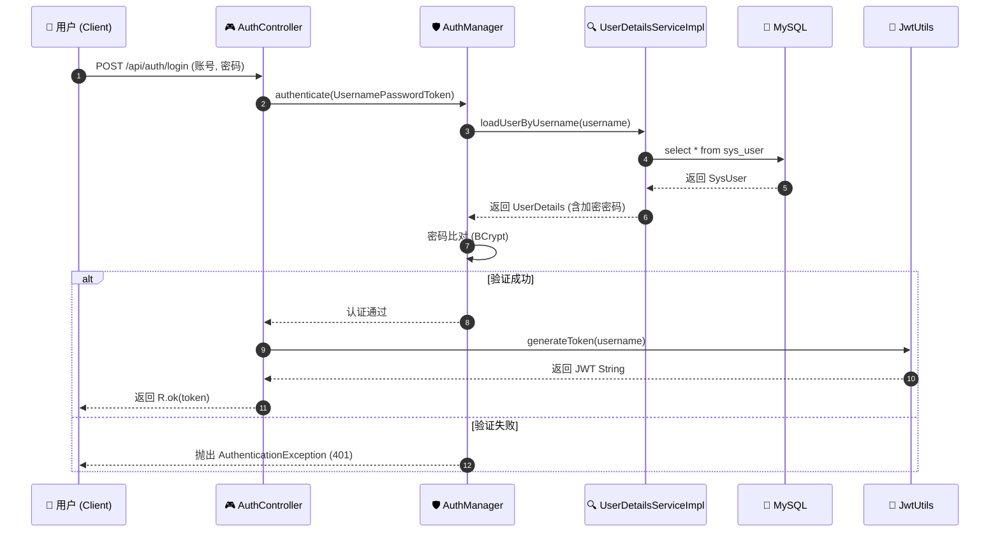
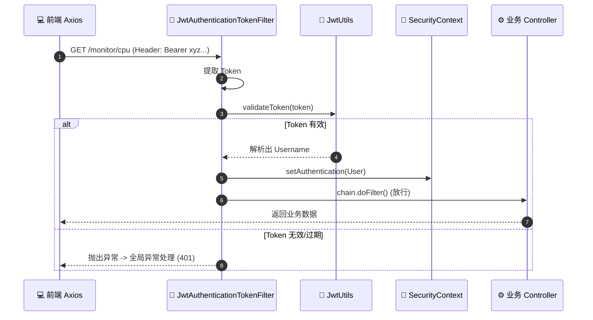
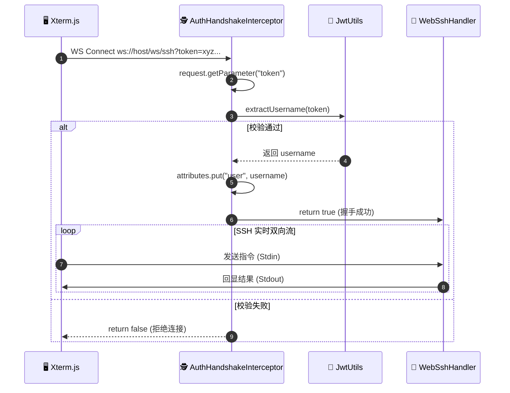

---

### 📄 SECURITY.md (修复版)

```markdown
# 🔐 Monitor System | 安全鉴权体系架构文档

> **版本**: 1.0
> **技术栈**: Spring Boot 3.3 + Spring Security 6 + JWT + WebSocket
> **架构模式**: RBAC (基于角色的访问控制) / Stateless (无状态认证)

---

## 📖 1. 体系概述 (Overview)

本系统采用现代化的 **前后端分离无状态鉴权体系**。摒弃了传统的 Session/Cookie 模式，采用 **JWT (JSON Web Token)** 作为身份凭证。此架构具有极高的扩展性，天然支持分布式部署，并解决了 Web 端与 WebSocket 长连接场景下的统一鉴权问题。

### 核心设计理念：机场安检模型
为了便于理解，我们将鉴权体系比作机场安检：
*   **登录 (Login)** = **办理登机牌**。用户凭身份证（账号密码）换取登机牌（Token）。
*   **API 访问 (HTTP)** = **过安检通道**。每次请求必须出示登机牌，安检员（Filter）验证无误后放行。
*   **远程终端 (WebSocket)** = **VIP 通道**。握手时需出示凭证，验证通过后建立长连接。

---

## 🏗 2. 核心组件角色 (Component Roles)

下表详细定义了系统中各个 Java 类的职责与作用：

| 组件类名 | 对应角色 | 核心职责 |
| :--- | :--- | :--- |
| **SysUser** | 档案 | 数据库 `sys_user` 表的映射实体，纯数据载体。 |
| **UserDetailsServiceImpl** | **翻译官** | 连接数据库与 Security 框架。将 `SysUser` 转换为框架能理解的 `UserDetails` 对象。 |
| **JwtUtils** | **印钞/验钞机** | **生成 Token**: 登录成功后签发。<br>**解析 Token**: 请求到来时验证签名与有效期。 |
| **JwtAuthenticationTokenFilter** | **HTTP 安检门** | 拦截所有 HTTP 请求，从 Header 提取 Token，校验并构建 `SecurityContext`。 |
| **AuthHandshakeInterceptor** | **WS 门童** | 拦截 WebSocket 握手请求，从 URL 参数提取 Token，校验并放行连接。 |
| **SecurityConfiguration** | **安保手册** | 配置全局安全策略：放行哪些接口（如 `/login`）、配置加密算法、注册过滤器。 |
| **GlobalExceptionHandler** | **善后专员** | 统一处理认证失败 (401)、权限不足 (403) 及其他业务异常。 |

---

## 🔄 3. 核心业务流程 (Workflows)

### 3.1 用户登录流程 (Login Flow)
用户首次访问系统，换取凭证的过程。



### 3.2 HTTP API 鉴权流程 (Token Filter)
用户携带 Token 访问受保护的接口（如获取 CPU 数据）。



### 3.3 WebSSH WebSocket 鉴权流程 (Special Case)
由于浏览器 WebSocket API 不支持自定义 Header，我们采用 URL 参数传递 Token。



---

## 💾 4. 数据库设计 (Database Schema)

基于 RBAC 模型的基础用户表设计，支持丰富的用户画像。

```sql
CREATE TABLE `sys_user` (
  `id` bigint NOT NULL AUTO_INCREMENT COMMENT '主键ID',
  `username` varchar(64) NOT NULL COMMENT '登录账号',
  `password` varchar(128) NOT NULL COMMENT 'BCrypt加密密码',
  `nickname` varchar(64) DEFAULT NULL COMMENT '用户昵称',
  `role` varchar(50) DEFAULT 'ROLE_USER' COMMENT '角色权限',
  `avatar` varchar(255) DEFAULT '' COMMENT '头像URL',
  `email` varchar(128) DEFAULT NULL COMMENT '联系邮箱',
  `bio` varchar(500) DEFAULT NULL COMMENT '个人简介',
  `create_time` datetime DEFAULT CURRENT_TIMESTAMP COMMENT '创建时间',
  `update_time` datetime DEFAULT CURRENT_TIMESTAMP ON UPDATE CURRENT_TIMESTAMP COMMENT '更新时间',
  PRIMARY KEY (`id`),
  UNIQUE KEY `uk_username` (`username`)
) ENGINE=InnoDB DEFAULT CHARSET=utf8mb4 COMMENT='系统用户表';
```

---

## 📂 5. 关键代码目录结构

为了体现规范性，安全相关代码被严格分层：

```text
monitor-server/src/main/java/com/monitor/server
├── config
│   ├── SecurityConfiguration.java   # 全局安全配置链
│   └── WebSocketConfig.java         # 注册 WebSocket 拦截器
├── filter
│   └── JwtAuthenticationTokenFilter.java # HTTP 过滤器
├── handler
│   └── AuthHandshakeInterceptor.java     # WebSocket 握手拦截器
├── service
│   └── impl
│       └── UserDetailsServiceImpl.java   # 用户信息加载逻辑
└── utils
    └── JwtUtils.java                     # JWT 工具类 (Sign/Verify)
```

---

## 🛡️ 6. 安全扩展性思考 (Future Work)

当前体系已经能满足中小型系统的需求，未来可向以下方向升级：

1.  **RefreshToken 机制**：当前 Token 过期需重新登录。可引入双 Token 机制（Access + Refresh），在无感的情况下刷新 Token。
2.  **动态权限控制**：目前是基于代码注解的权限控制。可引入 RBAC 权限表（`sys_menu`, `sys_role_menu`），实现菜单级别的动态权限分配。
3.  **多端登录管理**：在 Redis 中存储 Token 白名单，实现“踢人下线”或“单点登录”功能。
```