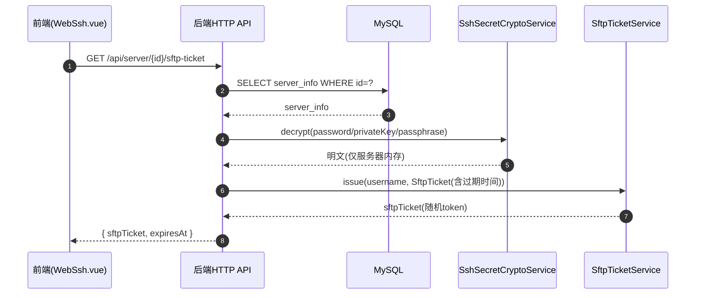
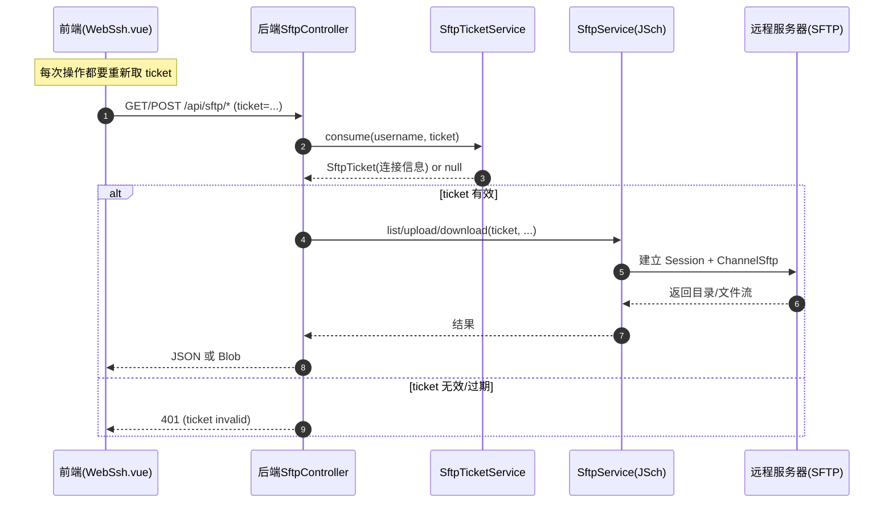

# 📁 SFTP 远程文件管理模块技术文档 v1.0

> **模块名称**：SFTP Remote File Module
>
> **核心功能**：在浏览器端实现远程服务器目录浏览、文件上传、文件下载（基于 SFTP 协议）
>
> **技术关键词**：Spring Boot 3.3、Spring Security + JWT、JSch(SFTP)、一次性 Ticket、Vue3 + Element Plus、Axios(Blob/Multipart)

---

## 📚 1. 体系概述 (Overview)

### 1.1 这个模块解决什么问题？

很多监控/运维场景里，我们希望：

- 在网页上像“文件管理器”一样查看服务器目录
- 上传配置文件、脚本、证书等到服务器
- 下载日志、导出的报表等文件到本地

如果直接把服务器的 **SSH 密码 / 私钥** 发到浏览器，会有很大的安全风险。

因此本项目采用了一个比较安全且易理解的方案：

1. 前端不会拿到服务器的明文密码/私钥
2. 前端每次要操作文件时，先向后端申请一个 **一次性 SFTP Ticket**
3. 前端带着 Ticket 调用后端的 `/api/sftp/*` 接口
4. 后端在内存里用 Ticket 拼出连接信息，使用 **JSch 建立 SFTP 连接**，完成上传/下载/列目录

### 1.2 术语小词典（初学者可先看这里）

- **SFTP**：基于 SSH 的文件传输协议，通常端口也是 22。
- **JSch**：Java 里常见的 SSH/SFTP 客户端库，本项目用它来连远程服务器。
- **Ticket（票据）**：一个短期 token。前端拿到 ticket 后，并不能直接“登录服务器”，只能调用本系统的文件接口。
- **Multipart 上传**：浏览器通过 `FormData` 把文件发给后端，后端再把文件流转发到 SFTP。
- **Blob 下载**：浏览器把后端返回的二进制流当做文件处理并触发保存。

### 1.3 设计原则

- **不下发明文凭证 (No Plaintext Delivery)**：浏览器侧不保存服务器密码/私钥
- **一次性票据 (One-time Ticket)**：Ticket 只能用一次（用完即失效），并且有过期时间
- **用户隔离 (Owner Binding)**：Ticket 与登录用户名绑定，避免被其他用户拿到后越权使用
- **可扩展**：当前 Ticket 缓存在 JVM 内存；未来支持多实例部署时可迁移到 Redis

---

## 🏗 2. 深度技术架构 (Deep Dive Architecture)

### 2.1 架构分层

| 层 | 组件/文件 | 作用 |
| :--- | :--- | :--- |
| 前端 API | `monitor-web/src/api/sftp.js` | 对后端 SFTP 接口进行封装 |
| 前端页面 | `monitor-web/src/views/monitor/WebSsh.vue` | 文件面板：目录浏览 + 上传/下载（位于 WebSSH 页面内） |
| 后端 Controller | `SftpController` | `/api/sftp/list` `/api/sftp/upload` `/api/sftp/download` |
| 后端 Controller | `ServerSftpTicketController` | `/api/server/{id}/sftp-ticket` 签发一次性 Ticket |
| 后端 Service | `SftpTicketService` | Ticket 的签发与一次性消费（内存 Map） |
| 后端 Service | `SftpService` | 基于 JSch 打开 SFTP 连接，执行 ls/get/put |
| 安全/加密 | `SshSecretCryptoService` | 解密数据库里保存的 password/privateKey/passphrase |
| 数据层 | MySQL `server_info` | 存放服务器连接信息（敏感字段加密保存） |

### 2.2 关键“数据流”（从点击到真的上传/下载）

这部分建议 Java 初学者重点看：你写业务时，要能清楚“请求从哪来 → 到哪去 → 数据怎么流动”。

#### 2.2.1 获取一次性 Ticket

#### 2.2.2 列目录 / 上传 / 下载

---

## 🔌 3. 接口设计（API Contract）

> 说明：本项目后端统一返回结构为 `R<T>`（见 `monitor-common`），其中 `code=200` 表示成功，其他 code 表示失败。
> 对于下载接口，由于返回的是二进制流（Blob），前端会绕过 `R<T>` 解析（见 `monitor-web/src/utils/request.js`）。

### 3.1 获取一次性 Ticket

- **URL**：`GET /api/server/{id}/sftp-ticket`
- **用途**：为某台服务器签发一个短期、一次性的 SFTP 操作 ticket
- **返回 DTO**：`SftpTicketResponse`
  - `serverId`：服务器 ID
  - `sftpTicket`：一次性 ticket（字符串）
  - `expiresAt`：过期时间（默认 60 秒后）

常见响应：

- `200`：成功
- `403`：当前用户无权访问该服务器（`server.createBy` 不匹配）
- `404`：服务器不存在

### 3.2 列目录

- **URL**：`GET /api/sftp/list`
- **参数（Query）**：
  - `ticket`：一次性 ticket（必填）
  - `path`：目录路径（可选，不传默认 `/`）
- **返回 DTO**：`List<SftpListItem>`

### 3.3 上传文件

- **URL**：`POST /api/sftp/upload`
- **Content-Type**：`multipart/form-data`
- **参数（Form）**：
  - `ticket`：一次性 ticket（必填）
  - `targetDir`：目标目录（必填）
  - `overwrite`：是否覆盖（可选，默认 `false`）
  - `file`：上传文件（必填）
- **返回 DTO**：`SftpUploadResponse`
  - `remotePath`：远程保存路径
  - `size`：保存后文件大小（如果能 stat 到）

特殊响应：

- `409`：`overwrite=false` 且远程文件已存在（后端直接拒绝覆盖）

### 3.4 下载文件

- **URL**：`GET /api/sftp/download`
- **参数（Query）**：
  - `ticket`：一次性 ticket（必填）
  - `path`：远程文件完整路径（必填）
- **返回**：二进制流（`application/octet-stream`），并设置 `Content-Disposition` 触发浏览器下载

---

## 🧩 4. 核心实现说明（面向初学者详细讲解）

### 4.1 Ticket 为什么要“一次性”？

Ticket 的目标是“把非常敏感的 SSH 凭证，换成一个短期、可控的临时票据”。

- **一次性消费**：避免 ticket 被截获后重复使用（重放攻击）
- **绑定用户**：即便被别人拿到，也无法消费（因为 username 不一致）

对应实现：`monitor-server/.../SftpTicketService.java`

- `issue(ownerUsername, ticket)`：生成随机 token，写入内存 Map
- `consume(ownerUsername, token)`：从 Map `remove` 删除并返回（所以是一次性）

> 注意：当前实现的 Ticket 缓存在 JVM 内存里。
> - 单体部署/开发环境没问题
> - 多实例部署（Nginx 负载均衡）时，ticket 可能被分配到不同实例，建议迁移到 Redis

### 4.2 Ticket 的内容是什么？会不会泄露密码？

Ticket **本身只是一个随机字符串**。

真正的“连接信息”保存在服务器内存对象 `SftpTicket` 里，主要字段包括：

- `host` `port` `sshUsername`
- `authType`（`password` 或 `publicKey`）
- `password` 或 `privateKeyPem` + `passphrase`
- `expireAt`

这些字段不会返回给前端。

### 4.3 后端如何连接 SFTP（JSch）

对应实现：`monitor-server/.../SftpService.java`

核心步骤：

1. 创建 `JSch`
2. 根据认证方式决定：
   - `publicKey`：`jsch.addIdentity(...)` 把私钥 PEM 放入内存
   - `password`：`session.setPassword(...)`
3. `jsch.getSession(username, host, port)` + `session.connect()`
4. `session.openChannel("sftp")` 得到 `ChannelSftp`
5. 用 `ChannelSftp` 执行：
   - 列目录：`ls(path)`
   - 下载：`get(remotePath, out)`
   - 上传：`put(in, remotePath)`

> 初学者提醒：
> - `Session` / `Channel` 都属于“网络资源”，必须关闭。这里用了 `try-with-resources` + `AutoCloseable` 包装，确保断开连接。

### 4.4 路径与文件名为什么要“规范化”？

对应实现：`SftpService.normalizePath()` 与 `sanitizeFileName()`

这是为了避免常见安全问题：

- `..` 路径穿越：比如传入 `../../etc/passwd`
- 使用 Windows 反斜杠 `\` 导致路径判断错误
- 文件名为空、`.`、`..` 等不合法值

本项目做法：

- 把 `\` 统一替换为 `/`
- 请求路径包含 `..` 直接拒绝（抛 `400 路径不合法`）
- 上传时只保留文件名部分，避免把客户端路径当成服务端路径

### 4.5 上传（Multipart）与下载（Blob）怎么工作？

#### 上传：`POST /api/sftp/upload`

后端：`SftpController.upload()`

- 参数：`ticket` `targetDir` `overwrite` `file(MultipartFile)`
- 关键点：用 `file.getInputStream()` 流式上传到 `ChannelSftp.put(...)`

前端：`WebSsh.vue` 自定义 uploadRequest

- 使用 `FormData`：
  - `fd.append('ticket', ticket)`
  - `fd.append('targetDir', currentPath)`
  - `fd.append('overwrite', 'false')`
  - `fd.append('file', rawFile)`
- 使用 axios 的 `onUploadProgress` 显示进度条

#### 下载：`GET /api/sftp/download`

后端：`SftpController.download()`

- 设置 `Content-Disposition: attachment; filename*=UTF-8''...`（兼容中文文件名）
- `response.getOutputStream()` 直接写入 SFTP `get()` 得到的流

前端：`WebSsh.vue` downloadFile

- `responseType: 'blob'`
- 把 blob 转成 `URL.createObjectURL(blob)`
- 创建 `<a download>` 触发浏览器保存

---

## 🔐 5. 安全设计与权限边界

### 5.1 接口是否需要登录？

需要。`SecurityConfiguration` 中配置了：

- `/api/auth/login` `/api/auth/register` `/api/auth/refresh` 等少数接口放行
- **其余所有接口**：`anyRequest().authenticated()`

因此 SFTP 相关接口都需要携带 JWT（浏览器 LocalStorage 的 token）。

### 5.2 服务器归属校验（防止越权）

`ServerSftpTicketController` 在签发 ticket 前做了两层检查：

1. 服务器是否存在
2. `server.createBy` 是否等于当前登录 username

不满足则：

- 404：服务器不存在
- 403：无权访问此服务器

### 5.3 错误码与提示信息是怎么统一的？

对应实现：`monitor-server/.../SftpErrorRegistry.java`

后端会把 JSch 的异常“翻译”为更稳定、面向用户的提示，例如：

- `SFTP_CONNECT_FAILED`：连接服务器失败（网络/账号/认证方式问题）
- `SFTP_PERMISSION_DENIED`：权限不足
- `SFTP_NOT_FOUND`：目录或文件不存在

> 说明：Controller 层对 ticket 无效会直接返回 401；
> 其他底层异常由 `SftpService` 映射后通常作为 500 返回（message 更友好）。

### 5.4 已知限制与改进方向

- **StrictHostKeyChecking = no**：当前为了“开箱即用”关闭了主机指纹校验。
  - 生产建议：维护 known_hosts 或记录指纹，开启校验，防止中间人攻击。
- Ticket 缓存在 JVM 内存：多实例部署建议接入 Redis。
- 当前只实现：list/upload/download。
  - 可扩展：mkdir、rm、rename、chmod、递归下载/上传等。

---

## 🧪 6. 调试与排错指南（新手友好）

### 6.1 常见错误与定位

| 现象 | 可能原因 | 建议排查 |
| :--- | :--- | :--- |
| 前端提示“ticket 已失效” | ticket 一次性、或过期（默认 60 秒） | 每次调用 list/upload/download 前重新 `GET /sftp-ticket` |
| “连接服务器失败” | IP/端口不通、账号错误、认证方式不匹配 | 先用本地 ssh/sftp 客户端验证，再检查 `ServerInfo` 配置 |
| “权限不足” | 目标目录无写权限/读权限 | 换路径、或在服务器上给账号授权 |
| 上传失败且提示大小超限 | Spring Multipart 限制 | 检查 `application.yml` 的 `spring.servlet.multipart.max-file-size` / `max-request-size` |
| 下载进度条不动 | 服务器没返回 Content-Length（不一定有） | 这属于正常情况：`evt.total` 为空时只能显示“下载中” |

### 6.2 前端关键代码入口（便于跟代码）

- ticket 获取：`WebSsh.vue` → `fetchOneTimeSftpTicket()` → `getServerSftpTicket(serverId)`
- 列目录：`WebSsh.vue` → `refreshList()` → `sftpList({ ticket, path })`
- 上传：`WebSsh.vue` → `uploadRequest()` → `POST /api/sftp/upload`
- 下载：`WebSsh.vue` → `downloadFile()` → `GET /api/sftp/download`

### 6.3 后端关键相关文件速查

- Controller：
  - `monitor-server/src/main/java/com/xu/monitorserver/controller/ServerSftpTicketController.java`
  - `monitor-server/src/main/java/com/xu/monitorserver/controller/SftpController.java`
- Service：
  - `monitor-server/src/main/java/com/xu/monitorserver/service/sftp/SftpTicketService.java`
  - `monitor-server/src/main/java/com/xu/monitorserver/service/sftp/SftpService.java`
  - `monitor-server/src/main/java/com/xu/monitorserver/service/sftp/SftpErrorRegistry.java`

---

## ✅ 7. 本文档与代码的一致性说明

- 后端接口前缀：`/api/sftp` 与 `/api/server/{id}/sftp-ticket`
- Ticket 默认过期：`Instant.now().plusSeconds(60)`（1 分钟）
- 上传大小限制：默认示例配置为 `200MB`（请以 `monitor-server/src/main/resources/application.yml` 为准）
- SFTP 底层库：`com.github.mwiede:jsch:0.2.11`

如需增加功能（删除/重命名/新建目录），建议沿用当前模式：

1. 前端先拿 ticket
2. 后端 consume ticket
3. `SftpService` 内统一做 path normalize + 异常映射
