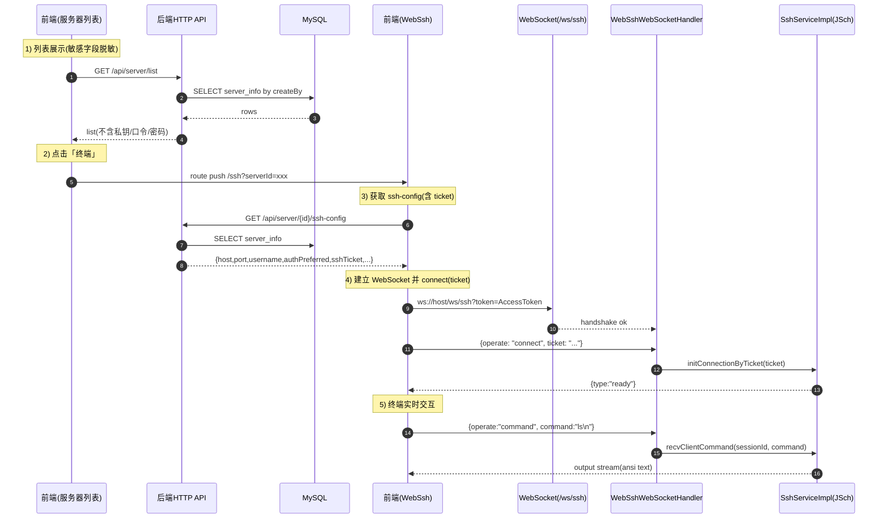

# 🖥️ WebSSH 远程连接 & 服务器管理模块技术文档 v1.1

> **模块名称**：WebSSH & Server Manage Module
>
> **核心功能**：服务器资产管理（增删改查）+ 浏览器在线终端（WebSocket 实时交互，支持 Ticket 自动连接）
>
> **技术关键词**：Spring Boot 3.3、Spring WebSocket、Spring Security + JWT、JSch(SSH/ChannelShell)、MyBatis-Plus、AES/GCM 凭证加密、Vue3 + Element Plus、xterm.js

---

## 📚 1. 体系概述 (Overview)

### 1.1 这个模块解决什么问题？

在很多运维/监控类系统里，我们经常会遇到这些需求：

- 我想把服务器“资产信息”统一管理起来（IP、端口、账号、认证方式等）
- 我想在网页里直接打开终端，像执行 `ssh root@host` 一样实时输入命令、实时看到输出
- 我不希望把服务器的 SSH 密码/私钥明文发给浏览器（浏览器端一旦被 XSS、截图、抓包，就非常危险）

所以本项目把“服务器管理”和“WebSSH 终端”做成一个模块，并采用了一个对新手也友好的安全思路：

1. **服务器凭证只保存在数据库（并且加密存储）**，前端列表接口不返回明文密码/私钥
2. 前端进入终端时，先向后端申请一个 **短时有效、一次性消费的 Ticket**
3. 前端用 **WebSocket** 建立一个实时通道
4. 前端发送 `connect(ticket)`，后端用 ticket 在服务器内存里取到连接信息，使用 **JSch** 真正去连目标服务器
5. 以后每次输入命令，就通过 WebSocket 发给后端，后端把 SSH 输出流实时推到前端的 xterm.js

一句话总结：**前端只负责“显示终端 + 发送按键”，真正的 SSH 连接发生在后端**。

### 1.2 术语小词典（初学者先看这段会更顺）

- **WebSSH**：在浏览器里提供一个“像 SSH 一样”的终端体验，本质是：浏览器 ⇄ WebSocket ⇄ 后端 ⇄ SSH 服务器。
- **WebSocket**：一种长连接协议，适合实时交互（终端就是典型场景）。
- **JSch**：Java 常用的 SSH 库，能创建 SSH Session，并打开 `ChannelShell`（交互式终端）。
- **ChannelShell**：JSch 中“可交互的 shell 通道”，可以写入命令（输出到远端），也能读取远端输出。
- **Ticket（一次性票据）**：后端签发给前端的临时 token。它本身不是 SSH 密码，只是一个“短期通行证”，用于告诉后端“我是谁 + 我要连哪台服务器”。
- **ANSI 输出**：终端输出里带颜色和控制符（例如 `ls` 的颜色、`top` 的刷新），前端一般用 xterm.js 渲染。

### 1.3 设计原则（与本项目实现对齐）

- **凭证不下发 (No Plaintext Delivery)**：服务器列表/详情接口不下发明文密码、私钥、口令。
- **一次性 Ticket (One-time Ticket)**：ticket 短期有效 + 使用一次后立即失效，降低重放风险。
- **用户隔离 (Owner Binding)**：ticket 与当前登录用户绑定，避免被其他用户拿去越权连接。
- **体验优先**：输出尽量原样透传（ANSI），前端用 xterm.js 呈现真实终端体验。

---

## 🏗 2. 深度技术架构 (Deep Dive Architecture)

### 2.1 架构分层

| 层 | 组件/文件 | 作用 |
| :--- | :--- | :--- |
| 前端页面 | `monitor-web/src/views/monitor/ServerManage.vue` | 服务器资产 CRUD、进入终端 |
| 前端页面 | `monitor-web/src/views/monitor/WebSsh.vue` | xterm 终端渲染、WebSocket 协议交互 |
| 后端 HTTP | `ServerInfoController` | 服务器管理 API、签发 ssh-ticket/返回 ssh-config |
| 后端 Service | `ServerInfoServiceImpl` | 字段规范化、脱敏、（可选）加解密协作 |
| 后端 WebSocket | `WebSshWebSocketHandler` | WS 握手鉴权、connect/command 消息分发 |
| 后端 SSH | `SshServiceImpl` | JSch 建连、ChannelShell 读写、输出推送 |
| 后端 Ticket | `SshTicket` + 相关 Service | ticket 的签发/一次性消费/绑定用户 |
| 数据层 | MySQL `server_info` | 服务器资产与 SSH 凭证持久化 |

### 2.2 关键“数据流”（从列表到真正建立终端）

> 建议初学者重点看这段：你写业务时要能说清楚“请求从哪来 → 经过哪些组件 → 最终落到哪里”。



---

## 💾 3. 数据模型与存储策略 (Data Model Strategy)

### 3.1 ServerInfo 关键字段（与 WebSSH 强相关）

实体（参考）：`monitor-server/src/main/java/com/xu/monitorserver/entity/ServerInfo.java`

| 字段 | 含义 | 新手备注 |
| :--- | :--- | :--- |
| `ip` | 目标地址 | IP 或域名 |
| `port` | SSH 端口 | 通常 22 |
| `username` | 登录用户名 | 如 `root` |
| `password` | 密码 | **敏感**：不回显、不下发（通常加密存储） |
| `privateKeyEnc` | 私钥密文 | **敏感**：不下发；后端解密后仅在内存短暂使用 |
| `keyPassphraseEnc` | 口令密文 | **敏感**：仅后端解密使用 |
| `hasPrivateKey` | 是否配置私钥 | 前端可用它做展示与提示 |
| `privateKeyFingerprint` | 私钥指纹 | 不是私钥本身，用于提示 |
| `createBy` | 所属用户 | 做多用户隔离（只能连自己的服务器） |

### 3.2 SSH 凭证为什么要“加密存库”？

实现类（参考）：`SshSecretCryptoService`

- 加密算法：`AES/GCM/NoPadding`
- 密钥来源：配置项 `monitor.crypto.ssh-secret-key`
- 目的：就算数据库泄露，也尽量降低明文密码/私钥泄露的风险

> 注意：加密存库 ≠ 绝对安全。
> - 密钥不要写死在代码里
> - 生产环境建议使用环境变量/密钥管理系统（KMS）托管

---

## 🔌 4. 接口设计（API Contract）

> 说明：下面只列出与 WebSSH/ServerManage 强相关的接口风格。
> 实际路径/DTO 以代码为准；本文更关注“调用顺序”和“字段含义”。

### 4.1 服务器资产管理（CRUD）

- `GET /api/server/list`：查询当前用户的服务器列表（敏感字段脱敏）
- `POST /api/server`：新增服务器
- `PUT /api/server/{id}`：修改服务器
- `DELETE /api/server/{id}`：删除服务器

新手提示：
- **列表接口**建议不要返回 `password/privateKey/passphrase`，最多返回 `hasPrivateKey` 这种布尔标识。

### 4.2 获取 ssh-config / 签发 ticket（进入终端前的准备）

- `GET /api/server/{id}/ssh-config`

典型返回内容（示意）：

- `host` / `port` / `username`：用于展示/连接
- `authPreferred`：推荐认证方式（比如优先 publicKey）
- `sshTicket`：一次性 ticket（前端真正用它走 WS connect）
- `expiresAt`：ticket 过期时间（前端可用于提示或自动刷新 ticket）

---

## 🧷 5. WebSocket 协议与交互 (Protocol)

WebSocket 入口：`/ws/ssh?token=<accessToken>`

### 5.1 为什么 WebSSH 必须用 WebSocket？

因为终端交互是“连续输入 + 连续输出”的：

- 用户每按一个键，都要快速发到后端
- 后端的输出也要不断推回来

HTTP 当然也能做，但会非常别扭（轮询、长轮询、延迟高）。WebSocket 天生适合这种实时通道。

### 5.2 握手鉴权（WS 层先确认你是谁）

- 前端在 URL query 上带 `token`（Access Token）
- 后端握手拦截器解析 token，拿到 `username`（或 userId）写入 session attributes
- 后续消费 ticket 时，会校验：**ticket.owner 必须等于当前 WS 用户**

### 5.3 前端 → 后端（消息格式）

#### 5.3.1 connect（推荐：ticket 模式）

```json
{ "operate": "connect", "ticket": "..." }
```

#### 5.3.2 command（执行命令/发送输入）

```json
{ "operate": "command", "command": "ls\n" }
```

> 新手提示：这里一般要带 `\n`，相当于用户敲了回车。

### 5.4 后端 → 前端（事件 + 透传输出）

事件：

- ready：

```json
{ "type": "ready" }
```

- error（建议统一结构，前端好提示）：

```json
{ "type": "error", "code": "SSH_AUTH_FAILED", "message": "..." }
```

输出：

- SSH 输出通常是 **纯文本/ANSI**，后端会把它当成普通字符串推给前端
- 前端把输出写入 xterm.js 渲染

---

## 🧩 6. 核心实现说明（面向初学者的“拆解式讲解”）

### 6.1 Ticket 为什么要“一次性”？

Ticket 的目标是：**把“高风险的 SSH 凭证”换成“低风险的临时通行证”**。

如果 ticket 不是一次性的：
- 它一旦被抓包拿到，就可能被反复用来发起连接（重放攻击）

所以本模块的常见做法是：

- `issue(owner, payload)`：生成随机 token，写入后端内存/缓存
- `consume(owner, token)`：从缓存中 `remove` 并返回 payload（立刻失效）

> 新手提示：
> - 单体部署用 JVM 内存 Map 就能跑
> - 多实例部署（负载均衡）通常要把 ticket 放到 Redis，并保证“原子消费”

### 6.2 connect(ticket) 后，后端具体做了什么？

可以按这条线去理解：

1. `WebSshWebSocketHandler` 收到 `{operate:"connect"}`
2. 校验当前 WS 用户身份（握手阶段写入的 username）
3. 校验 ticket：
   - 是否存在
   - 是否过期
   - 是否属于当前用户
4. 拿 ticket 里的连接信息，调用 `SshServiceImpl` 建立 JSch Session
5. 打开 `ChannelShell`，开启 PTY（更像真实终端）
6. 后端启动一个后台任务持续读取远端输出流，推送到 WS

### 6.3 JSch 双认证（密码 / 私钥）怎么做？

实现类（参考）：`SshServiceImpl`

- **密码登录**：
  - `session.setPassword(password)`
- **私钥登录**：
  - `jsch.addIdentity("key", privateKeyBytes, null, passphraseBytes)`

共同点：

- 创建 Session：`jsch.getSession(username, host, port)`
- `session.connect()`
- 打开交互通道：`session.openChannel("shell")`（对应 `ChannelShell`）

### 6.4 终端输出为什么要“读循环”？

SSH 输出是连续流式的。

所以后端通常会：

- 起一个后台线程/线程池任务
- 循环读 `InputStream`
- 读到数据就通过 WS `sendMessage()` 推给前端

并且要特别注意：
- 连接断开/异常时要关闭 session/channel
- 防止线程泄露（每个终端一个读循环任务）

### 6.5 自动连接策略（优先私钥）

一个对用户更友好的细节：

- 如果服务器配置了私钥（`hasPrivateKey=true` 且密文非空），返回 `authPreferred=publicKey`
- 否则返回 `authPreferred=password`

前端拿到 `authPreferred` 后，可以自动发起 connect(ticket)，用户体验更像“一键进入终端”。

---

## 🧯 7. 安全注意事项与异常处理

### 7.1 常见失败场景（建议统一错误码）

| 场景 | 典型表现 | 建议错误码 |
| :--- | :--- | :--- |
| 网络不可达/超时 | connect timeout | `SSH_CONNECT_TIMEOUT` |
| 认证失败（密码错/无权限） | Auth fail | `SSH_AUTH_FAILED` |
| 私钥格式非法 | invalid privatekey | `SSH_KEY_INVALID` |
| 私钥口令错误 | invalid passphrase | `SSH_PASSPHRASE_INVALID` |
| ticket 不存在/过期/已消费 | invalid ticket | `SSH_TICKET_INVALID` |
| 缺少加解密 key | IllegalStateException | `SSH_CRYPTO_KEY_MISSING` |

### 7.2 前端提示建议（符合项目风格）

- 使用 Element-Plus 的 `ElMessage/ElNotification` 弹出错误
- 给用户看的 message 要“人话”（例如：请检查密码、请检查网络）
- 异常详情建议只打到后端日志或浏览器控制台
- 在 xterm 里也同步打印一行错误（终端场景更直观）

### 7.3 一个很关键但容易忽略的点：hostKey 校验

很多 Demo 会直接设置：`StrictHostKeyChecking=no`。

这能让连接更“省事”，但安全性会下降（可能遭遇中间人攻击）。

建议：

- 开发环境可以先这样快速跑通
- 生产环境可以考虑：
  - 维护 known_hosts
  - 或者提供“首次连接确认指纹”的流程

---

## ⚡ 8. 性能与并发（你需要知道的边界）

每个 WebSSH 会话通常会占用：

- 1 个 WebSocket 连接
- 1 个 JSch Session + 1 个 ChannelShell
- 1 个后端读循环任务（线程池）

因此建议：

- 限制单用户同时在线终端数量（避免把自己机器打爆）
- 读循环用线程池（限制最大线程数）
- 输出分段发送，避免单条消息过大导致前端渲染卡顿

---

## 🔍 9. 本地排错清单（按“从外到内”的顺序查）

1. **能不能 ping 通 / telnet 到端口？**（网络问题最常见）
2. 服务器端 `sshd` 是否运行？默认端口是不是 22？
3. 用户名/密码/私钥是否正确？是否有登录权限？
4. 后端日志有没有 `Auth fail` / `timeout` / `invalid privatekey`？
5. 前端 WS 是否成功建立？（浏览器 Network → WS 看是否 101）
6. ticket 是否过期/被重复使用？（一次性 ticket 如果复用必然失败）

---

## 🔮 10. 未来演进 (Future Tech)

1. **ticket 共享**：多实例部署时将 ticket 存到 Redis，并用原子操作保证一次性消费。
2. **终端 resize 支持**：前端上报 cols/rows，后端调用 PTY resize，提升 `vim/top` 体验。
3. **审计与风控**：记录连接建立/断开/命令输入（可选脱敏）用于审计。
4. **hostKey 策略可配置**：提供可选 hostKey 校验策略，更贴近生产环境。
