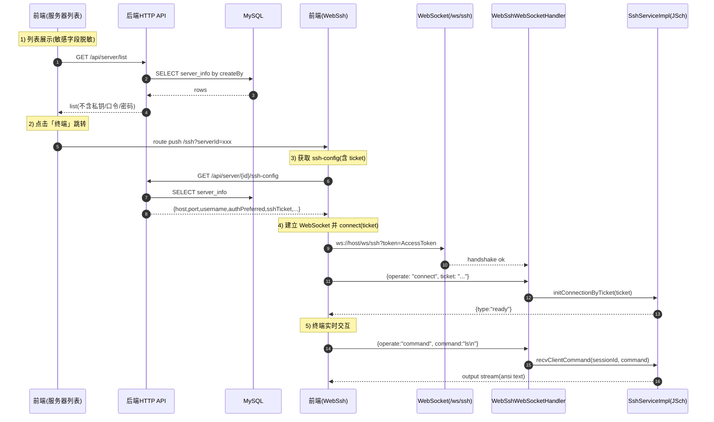

# 🖥️ WebSSH 远程连接 & 服务器管理模块技术文档 v1.0

> **模块名称**: WebSSH & Server Manage Module
>
> **核心功能**: 服务器资产管理（增删改查） + WebSSH 在线终端（自动连接 + 手动连接）
>
> **技术关键词**: Spring Boot 3.3, Spring WebSocket, Spring Security, JWT, JSch, MyBatis-Plus, Vue3, Element-Plus, xterm.js

---

## 📚 1. 体系概述 (Overview)

本模块解决两类核心业务问题：

1. **服务器管理（Server Manage）**
   - 维护服务器资产信息：名称、IP、端口、SSH 用户名
   - 维护 SSH 凭证信息：密码 / 私钥（PEM）/ 私钥口令（passphrase）
   - 列表查询时进行**敏感字段脱敏**，避免前端与浏览器侧泄露

2. **WebSSH 远程终端（Web SSH Terminal）**
   - 浏览器端提供交互式 Shell 终端，支持实时输入回显（类似 ssh 命令行）
   - 推荐模式：**Ticket 自动连接（前端不持有明文凭证）**
   - 兼容模式：历史能力保留（前端手动输入密码/私钥进行连接）

### 1.1 设计原则

- **凭证不下发（No Plaintext Delivery）**：服务器列表与连接配置接口不返回明文密码/私钥，前端使用 ticket 建联。
- **双认证能力（Password / PublicKey）**：同一套终端能力支持两种常见 SSH 认证方式。
- **一次性票据（One-time Ticket）**：ticket 短时有效、一次性消费、与用户绑定，减少重放风险。
- **交互体验优先**：后端尽量透传 ANSI 输出，前端使用 xterm.js 渲染，保持真实终端体验。

---

## 🏗 2. 深度技术架构 (Deep Dive Architecture)

### 2.1 架构分层

| 层 | 组件 | 作用 |
| :--- | :--- | :--- |
| 前端 | `monitor-web/src/views/monitor/ServerManage.vue` | 服务器 CRUD、一键进入终端 |
| 前端 | `monitor-web/src/views/monitor/WebSsh.vue` | xterm 终端渲染、WebSocket 连接、协议交互 |
| 后端（HTTP） | `ServerInfoController` | 服务器管理 API、生成 ssh-config(ticket) |
| 后端（Service） | `ServerInfoServiceImpl` | 服务器字段规范化/脱敏/（可选）加密处理 |
| 后端（WebSocket） | `WebSshWebSocketHandler` | WS 握手鉴权、connect/command 协议分发 |
| 后端（SSH） | `SshServiceImpl` | 基于 JSch 创建 SSH Session/ChannelShell、读写流 |
| 后端（Ticket） | `SshTicket`（及相关服务） | 连接载荷、一次性消费、绑定用户 |
| 数据层 | MySQL `server_info` | 服务器资产与 SSH 凭证持久化 |

### 2.2 数据流（从服务器列表到远程终端）



---

## 💾 3. 数据模型与存储策略 (Data Model Strategy)

### 3.1 ServerInfo 核心字段（与 WebSSH 强相关）

实体：`monitor-server/src/main/java/com/xu/monitorserver/entity/ServerInfo.java`

| 字段 | 含义 | 备注 |
| :--- | :--- | :--- |
| `ip` | SSH 目标地址 | 支持 IP/域名 |
| `port` | SSH 端口 | 默认 22 |
| `username` | SSH 用户名 | 用于认证 |
| `password` | SSH 密码 | **敏感字段**，不回显/不下发 |
| `privateKeyEnc` | 私钥密文 | **敏感字段**，不回显/不下发 |
| `keyPassphraseEnc` | 私钥口令密文 | **敏感字段**，不回显/不下发 |
| `privateKeyFingerprint` | 私钥指纹 | 非敏感，用于 UI 展示/提示 |
| `hasPrivateKey` | 是否配置私钥 | UI 展示/自动连接策略 |
| `createBy` | 所属用户 | 多用户隔离 |

### 3.2 落库加密（应用层）

实现类：`SshSecretCryptoService`

- 算法：`AES/GCM/NoPadding`
- 密钥：配置项 `monitor.crypto.ssh-secret-key`
- 密文格式：`Base64(IV + Ciphertext)`

> 说明：在本项目的实现中，服务端在保存与读取 SSH 凭证时，通过 `SshSecretCryptoService` 进行加解密。

---

## 🔌 4. WebSocket 协议与交互 (Protocol)

WebSocket 入口：`/ws/ssh?token=<accessToken>`

### 4.1 握手鉴权

- 使用 URL query 携带 `token`（Access Token）
- 握手拦截器解析 token，提取 username 并写入 session attributes
- 目的：确保 WS 通道的用户身份与后续 ticket 的 owner 一致

### 4.2 前端 -> 后端消息

#### 4.2.1 connect（推荐：ticket 模式）

```json
{ "operate": "connect", "ticket": "..." }
```

#### 4.2.2 connect（兼容：直传凭证）

密码登录：

```json
{
  "operate": "connect",
  "authType": "password",
  "host": "1.2.3.4",
  "port": 22,
  "username": "root",
  "password": "***"
}
```

密钥登录：

```json
{
  "operate": "connect",
  "authType": "publicKey",
  "host": "1.2.3.4",
  "port": 22,
  "username": "root",
  "privateKey": "-----BEGIN ...",
  "passphrase": "***"
}
```

#### 4.2.3 command

```json
{ "operate": "command", "command": "ls\n" }
```

### 4.3 后端 -> 前端事件

ready：

```json
{ "type": "ready" }
```

error（统一结构，便于前端精确提示）：

```json
{ "type": "error", "code": "SSH_AUTH_FAILED", "message": "..." }
```

> 注意：除事件外，SSH 输出以 **纯文本/ANSI** 形式透传，前端直接写入 xterm。

---

## ⚙️ 5. 关键实现细节 (Implementation Details)

### 5.1 SSH 连接与双认证（JSch）

实现类：`SshServiceImpl`

- **用户名 + 密码**：`session.setPassword(password)`
- **用户名 + 私钥**：`jsch.addIdentity("key", privateKeyBytes, null, passphraseBytes)`（或等价形式）

并且：
- 使用 `ChannelShell` 实现交互式终端
- `channel.setPty(true)` 保持更接近真实终端的行为
- `StrictHostKeyChecking=no`（当前模块策略：不校验 hostKey）

### 5.2 输出读取与推送

- 服务端后台线程循环读取 `InputStream`，并将输出写回 WebSocket
- 读取异常 / 断开时统一执行资源关闭：disconnect channel + session

### 5.3 自动连接策略（优先密钥）

- 若服务器记录存在可用私钥（`hasPrivateKey = 1` 且密文非空），则 `authPreferred = publicKey`
- 否则回退到 password

该策略由 `ssh-config` 接口返回，前端据此自动 connect(ticket)

---

## 🧯 6. 异常处理与容错机制

### 6.1 常见失败场景（建议映射为稳定错误码）

| 场景 | 典型表现 | 建议错误码 |
| :--- | :--- | :--- |
| 连接超时/网络不可达 | connect timeout | `SSH_CONNECT_TIMEOUT` |
| 认证失败（密码错误/无权限） | Auth fail | `SSH_AUTH_FAILED` |
| 私钥格式非法 | invalid privatekey | `SSH_KEY_INVALID` |
| 私钥口令错误 | decrypt/invalid passphrase | `SSH_PASSPHRASE_INVALID` |
| ticket 过期/不存在 | invalid ticket | `SSH_TICKET_INVALID` |
| 缺少加解密密钥配置 | IllegalStateException | `SSH_CRYPTO_KEY_MISSING` |

### 6.2 前端提示策略（符合现有风格）

- 使用 Element-Plus 的 `ElMessage`/`ElNotification`
- 错误 message 面向用户，detail（如异常原文）只写入控制台或后端日志
- xterm 内同步打印一行红色错误文本（用于终端场景更直观）

---

## ⚡ 7. 性能与并发 (Concurrency)

- 每个 WebSSH 会话会占用：
  - 一个 WebSocket 连接
  - 一个 JSch Session + ChannelShell
  - 一个后端读循环任务（线程池执行）

建议：
- 控制单用户并发连接数（可通过 handler 层做限制）
- 读循环使用共享线程池并限制最大线程数
- 对输出逐段发送，避免单条消息过大导致前端渲染卡顿

---

## 🔮 8. 未来演进 (Future Tech)

1. **多实例部署 ticket 共享**：将 ticket 存储迁移到 Redis，并通过 Lua/原子操作实现一次性消费。
2. **终端窗口 resize 支持**：前端上报 cols/rows，后端调用 channel pty resize，提升 vim/top 体验。
3. **审计与风控**：记录 ticket 签发、连接建立、断开、失败重试次数，支持告警。
4. **hostKey 策略可配置**：提供可选的 hostKey 校验/known_hosts 管理（生产环境更推荐）。

